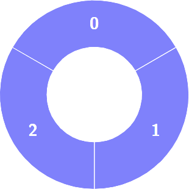
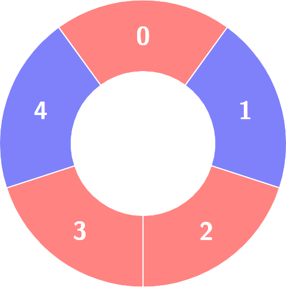
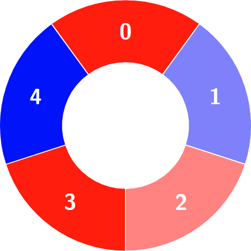
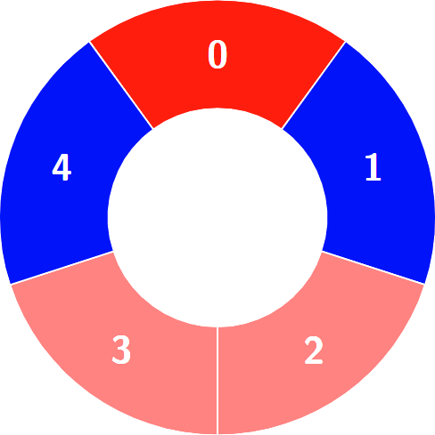
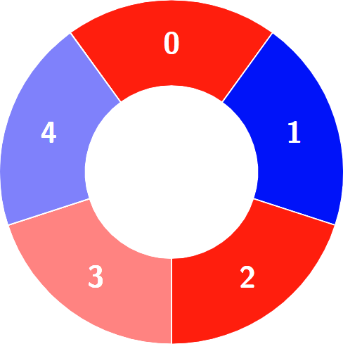

Can you solve this real interview question? Alternating Groups I - There is a circle of red and blue tiles. You are given an array of integers colors. The color of tile i is represented by colors[i]:

 * colors[i] == 0 means that tile i is red.
 * colors[i] == 1 means that tile i is blue.

Every 3 contiguous tiles in the circle with alternating colors (the middle tile has a different color from its left and right tiles) is called an alternating group.

Return the number of alternating groups.

Note that since colors represents a circle, the first and the last tiles are considered to be next to each other.

 

Example 1:

Input: colors = [1,1,1]

Output: 0

Explanation:

Example 2:

Input: colors = [0,1,0,0,1]

Output: 3

Explanation:

Alternating groups:

 

Constraints:

 * 3 <= colors.length <= 100
 * 0 <= colors[i] <= 1

---

## Images

- Image 1: `image_1.png`
- Image 2: `image_2.png`
- Image 3: `image_3.png`
- Image 4: `image_4.png`
- Image 5: `image_5.png`
