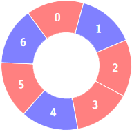

Can you solve this real interview question? Alternating Groups II - There is a circle of red and blue tiles. You are given an array of integers colors and an integer k. The color of tile i is represented by colors[i]:

 * colors[i] == 0 means that tile i is red.
 * colors[i] == 1 means that tile i is blue.

An alternating group is every k contiguous tiles in the circle with alternating colors (each tile in the group except the first and last one has a different color from its left and right tiles).

Return the number of alternating groups.

Note that since colors represents a circle, the first and the last tiles are considered to be next to each other.

 

Example 1:

Input: colors = [0,1,0,1,0], k = 3

Output: 3

Explanation:

Alternating groups:

Example 2:

Input: colors = [0,1,0,0,1,0,1], k = 6

Output: 2

Explanation:

Alternating groups:

Example 3:

Input: colors = [1,1,0,1], k = 4

Output: 0

Explanation:

 

Constraints:

 * 3 <= colors.length <= 105
 * 0 <= colors[i] <= 1
 * 3 <= k <= colors.length

---

## Images

- Image 1: `image_1.png`
- Image 2: `image_2.png`
- Image 3: `image_3.png`
- Image 4: `image_4.png`
- Image 5: `image_5.png`
- Image 6: `image_6.png`
- Image 7: `image_7.png`
- Image 8: `image_8.png`
