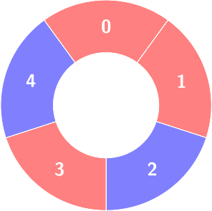
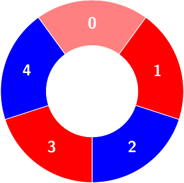
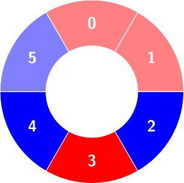

Can you solve this real interview question? Alternating Groups III - There are some red and blue tiles arranged circularly. You are given an array of integers colors and a 2D integers array queries.

The color of tile i is represented by colors[i]:

 * colors[i] == 0 means that tile i is red.
 * colors[i] == 1 means that tile i is blue.

An alternating group is a contiguous subset of tiles in the circle with alternating colors (each tile in the group except the first and last one has a different color from its adjacent tiles in the group).

You have to process queries of two types:

 * queries[i] = [1, sizei], determine the count of alternating groups with size sizei.
 * queries[i] = [2, indexi, colori], change colors[indexi] to colori.

Return an array answer containing the results of the queries of the first type in order.

Note that since colors represents a circle, the first and the last tiles are considered to be next to each other.

 

Example 1:

Input: colors = [0,1,1,0,1], queries = [[2,1,0],[1,4]]

Output: [2]

Explanation:

First query:

Change colors[1] to 0.

Second query:

Count of the alternating groups with size 4:

Example 2:

Input: colors = [0,0,1,0,1,1], queries = [[1,3],[2,3,0],[1,5]]

Output: [2,0]

Explanation:

First query:

Count of the alternating groups with size 3:

Second query: colors will not change.

Third query: There is no alternating group with size 5.

 

Constraints:

 * 4 <= colors.length <= 5 * 104
 * 0 <= colors[i] <= 1
 * 1 <= queries.length <= 5 * 104
 * queries[i][0] == 1 or queries[i][0] == 2
 * For all i that:
   * queries[i][0] == 1: queries[i].length == 2, 3 <= queries[i][1] <= colors.length - 1
   * queries[i][0] == 2: queries[i].length == 3, 0 <= queries[i][1] <= colors.length - 1, 0 <= queries[i][2] <= 1

---

## Images

- Image 1: `image_1.png`
- Image 2: `image_2.png`
- Image 3: `image_3.png`
- Image 4: `image_4.png`
- Image 5: `image_5.png`
- Image 6: `image_6.png`
- Image 7: `image_7.png`
