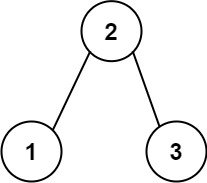

Can you solve this real interview question? Binary Tree Longest Consecutive Sequence II - Given the root of a binary tree, return the length of the longest consecutive path in the tree.

A consecutive path is a path where the values of the consecutive nodes in the path differ by one. This path can be either increasing or decreasing.

 * For example, [1,2,3,4] and [4,3,2,1] are both considered valid, but the path [1,2,4,3] is not valid.

On the other hand, the path can be in the child-Parent-child order, where not necessarily be parent-child order.

 

Example 1:

Input: root = [1,2,3]
Output: 2
Explanation: The longest consecutive path is [1, 2] or [2, 1].

Example 2:

Input: root = [2,1,3]
Output: 3
Explanation: The longest consecutive path is [1, 2, 3] or [3, 2, 1].

 

Constraints:

 * The number of nodes in the tree is in the range [1, 3 * 104].
 * -3 * 104 <= Node.val <= 3 * 104

---

## Images

- Image 1: `image_1.png`
- Image 2: `image_2.png`
