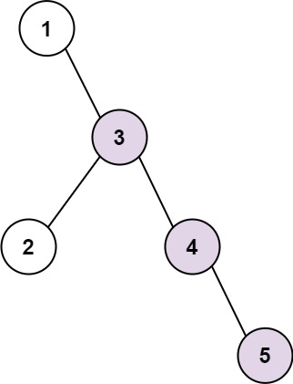

Can you solve this real interview question? Binary Tree Longest Consecutive Sequence - Given the root of a binary tree, return the length of the longest consecutive sequence path.

A consecutive sequence path is a path where the values increase by one along the path.

Note that the path can start at any node in the tree, and you cannot go from a node to its parent in the path.

 

Example 1:

Input: root = [1,null,3,2,4,null,null,null,5]
Output: 3
Explanation: Longest consecutive sequence path is 3-4-5, so return 3.

Example 2:

Input: root = [2,null,3,2,null,1]
Output: 2
Explanation: Longest consecutive sequence path is 2-3, not 3-2-1, so return 2.

 

Constraints:

 * The number of nodes in the tree is in the range [1, 3 * 104].
 * -3 * 104 <= Node.val <= 3 * 104

---

## Images

- Image 1: `image_1.png`
- Image 2: `image_2.png`
