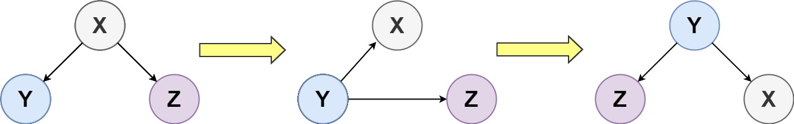

Can you solve this real interview question? Binary Tree Upside Down - Given the root of a binary tree, turn the tree upside down and return the new root.

You can turn a binary tree upside down with the following steps:

 1. The original left child becomes the new root.
 2. The original root becomes the new right child.
 3. The original right child becomes the new left child.

The mentioned steps are done level by level. It is guaranteed that every right node has a sibling (a left node with the same parent) and has no children.

 

Example 1:

Input: root = [1,2,3,4,5]
Output: [4,5,2,null,null,3,1]

Example 2:

Input: root = []
Output: []

Example 3:

Input: root = [1]
Output: [1]

 

Constraints:

 * The number of nodes in the tree will be in the range [0, 10].
 * 1 <= Node.val <= 10
 * Every right node in the tree has a sibling (a left node that shares the same parent).
 * Every right node in the tree has no children.

---

## Images

- Image 1: `image_1.png`
- Image 2: `image_2.png`
