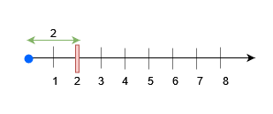

Can you solve this real interview question? Block Placement Queries - There exists an infinite number line, with its origin at 0 and extending towards the positive x-axis.

You are given a 2D array queries, which contains two types of queries:

 1. For a query of type 1, queries[i] = [1, x]. Build an obstacle at distance x from the origin. It is guaranteed that there is no obstacle at distance x when the query is asked.
 2. For a query of type 2, queries[i] = [2, x, sz]. Check if it is possible to place a block of size sz anywhere in the range [0, x] on the line, such that the block entirely lies in the range [0, x]. A block cannot be placed if it intersects with any obstacle, but it may touch it. Note that you do not actually place the block. Queries are separate.

Return a boolean array results, where results[i] is true if you can place the block specified in the ith query of type 2, and false otherwise.

 

Example 1:

Input: queries = [[1,2],[2,3,3],[2,3,1],[2,2,2]]

Output: [false,true,true]

Explanation:

For query 0, place an obstacle at x = 2. A block of size at most 2 can be placed before x = 3.

Example 2:

Input: queries = [[1,7],[2,7,6],[1,2],[2,7,5],[2,7,6]]

Output: [true,true,false]

Explanation:

 * Place an obstacle at x = 7 for query 0. A block of size at most 7 can be placed before x = 7.
 * Place an obstacle at x = 2 for query 2. Now, a block of size at most 5 can be placed before x = 7, and a block of size at most 2 before x = 2.

 

Constraints:

 * 1 <= queries.length <= 15 * 104
 * 2 <= queries[i].length <= 3
 * 1 <= queries[i][0] <= 2
 * 1 <= x, sz <= min(5 * 104, 3 * queries.length)
 * The input is generated such that for queries of type 1, no obstacle exists at distance x when the query is asked.
 * The input is generated such that there is at least one query of type 2.

---

## Images

- Image 1: `image_1.png`
- Image 2: `image_2.png`
