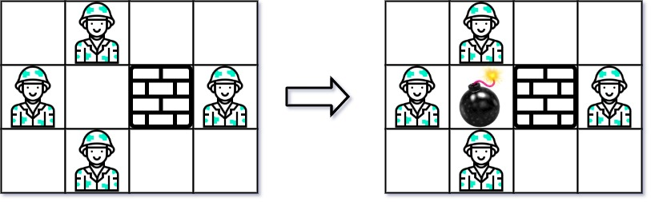
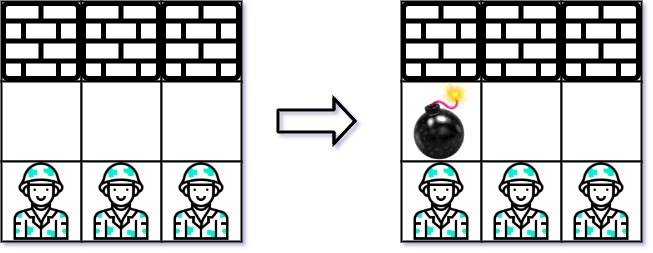

Can you solve this real interview question? Bomb Enemy - Given an m x n matrix grid where each cell is either a wall 'W', an enemy 'E' or empty '0', return the maximum enemies you can kill using one bomb. You can only place the bomb in an empty cell.

The bomb kills all the enemies in the same row and column from the planted point until it hits the wall since it is too strong to be destroyed.

 

Example 1:

Input: grid = [["0","E","0","0"],["E","0","W","E"],["0","E","0","0"]]
Output: 3

Example 2:

Input: grid = [["W","W","W"],["0","0","0"],["E","E","E"]]
Output: 1

 

Constraints:

 * m == grid.length
 * n == grid[i].length
 * 1 <= m, n <= 500
 * grid[i][j] is either 'W', 'E', or '0'.

---

## Images

- Image 1: `image_1.png`
- Image 2: `image_2.png`
