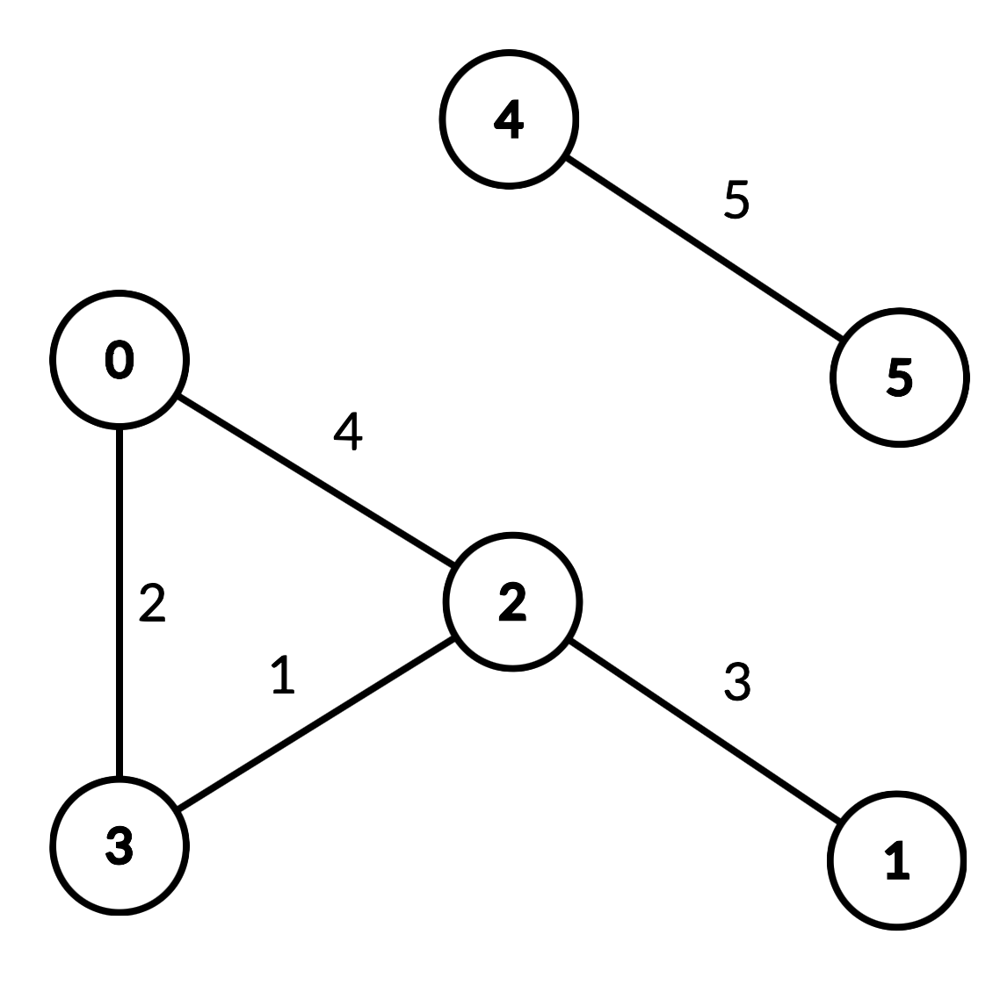

Can you solve this real interview question? Checking Existence of Edge Length Limited Paths II - An undirected graph of n nodes is defined by edgeList, where edgeList[i] = [ui, vi, disi] denotes an edge between nodes ui and vi with distance disi. Note that there may be multiple edges between two nodes, and the graph may not be connected.

Implement the DistanceLimitedPathsExist class:

 * DistanceLimitedPathsExist(int n, int[][] edgeList) Initializes the class with an undirected graph.
 * boolean query(int p, int q, int limit) Returns true if there exists a path from p to q such that each edge on the path has a distance strictly less than limit, and otherwise false.

 

Example 1:

Input
["DistanceLimitedPathsExist", "query", "query", "query", "query"]
[[6, [[0, 2, 4], [0, 3, 2], [1, 2, 3], [2, 3, 1], [4, 5, 5]]], [2, 3, 2], [1, 3, 3], [2, 0, 3], [0, 5, 6]]
Output
[null, true, false, true, false]

Explanation
DistanceLimitedPathsExist distanceLimitedPathsExist = new DistanceLimitedPathsExist(6, [[0, 2, 4], [0, 3, 2], [1, 2, 3], [2, 3, 1], [4, 5, 5]]);
distanceLimitedPathsExist.query(2, 3, 2); // return true. There is an edge from 2 to 3 of distance 1, which is less than 2.
distanceLimitedPathsExist.query(1, 3, 3); // return false. There is no way to go from 1 to 3 with distances strictly less than 3.
distanceLimitedPathsExist.query(2, 0, 3); // return true. There is a way to go from 2 to 0 with distance < 3: travel from 2 to 3 to 0.
distanceLimitedPathsExist.query(0, 5, 6); // return false. There are no paths from 0 to 5.

 

Constraints:

 * 2 <= n <= 104
 * 0 <= edgeList.length <= 104
 * edgeList[i].length == 3
 * 0 <= ui, vi, p, q <= n-1
 * ui != vi
 * p != q
 * 1 <= disi, limit <= 109
 * At most 104 calls will be made to query.

---

## Images

- Image 1: `image_1.png`
