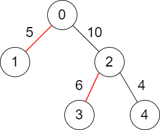
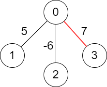

Can you solve this real interview question? Choose Edges to Maximize Score in a Tree - You are given a weighted tree consisting of n nodes numbered from 0 to n - 1.

The tree is rooted at node 0 and represented with a 2D array edges of size n where edges[i] = [pari, weighti] indicates that node pari is the parent of node i, and the edge between them has a weight equal to weighti. Since the root does not have a parent, you have edges[0] = [-1, -1].

Choose some edges from the tree such that no two chosen edges are adjacent and the sum of the weights of the chosen edges is maximized.

Return the maximum sum of the chosen edges.

Note:

 * You are allowed to not choose any edges in the tree, the sum of weights in this case will be 0.
 * Two edges Edge1 and Edge2 in the tree are adjacent if they have a common node.
   * In other words, they are adjacent if Edge1 connects nodes a and b and Edge2 connects nodes b and c.

 

Example 1:

Input: edges = [[-1,-1],[0,5],[0,10],[2,6],[2,4]]
Output: 11
Explanation: The above diagram shows the edges that we have to choose colored in red.
The total score is 5 + 6 = 11.
It can be shown that no better score can be obtained.

Example 2:

Input: edges = [[-1,-1],[0,5],[0,-6],[0,7]]
Output: 7
Explanation: We choose the edge with weight 7.
Note that we cannot choose more than one edge because all edges are adjacent to each other.

 

Constraints:

 * n == edges.length
 * 1 <= n <= 105
 * edges[i].length == 2
 * par0 == weight0 == -1
 * 0 <= pari <= n - 1 for all i >= 1.
 * pari != i
 * -106 <= weighti <= 106 for all i >= 1.
 * edges represents a valid tree.

---

## Images

- Image 1: `image_1.png`
- Image 2: `image_2.png`
