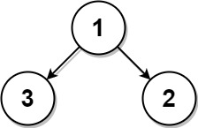
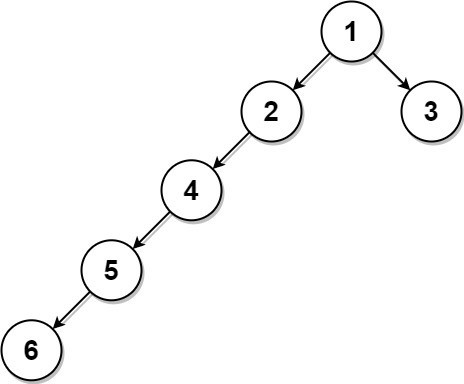

Can you solve this real interview question? Closest Leaf in a Binary Tree - Given the root of a binary tree where every node has a unique value and a target integer k, return the value of the nearest leaf node to the target k in the tree.

Nearest to a leaf means the least number of edges traveled on the binary tree to reach any leaf of the tree. Also, a node is called a leaf if it has no children.

 

Example 1:

Input: root = [1,3,2], k = 1
Output: 2
Explanation: Either 2 or 3 is the nearest leaf node to the target of 1.

Example 2:

Input: root = [1], k = 1
Output: 1
Explanation: The nearest leaf node is the root node itself.

Example 3:

Input: root = [1,2,3,4,null,null,null,5,null,6], k = 2
Output: 3
Explanation: The leaf node with value 3 (and not the leaf node with value 6) is nearest to the node with value 2.

 

Constraints:

 * The number of nodes in the tree is in the range [1, 1000].
 * 1 <= Node.val <= 1000
 * All the values of the tree are unique.
 * There exist some node in the tree where Node.val == k.

---

## Images

- Image 1: `image_1.png`
- Image 2: `image_2.png`
- Image 3: `image_3.png`
