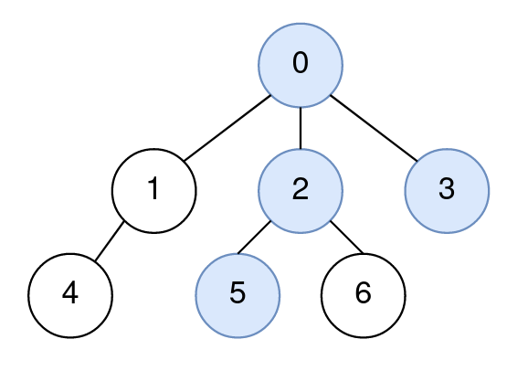

Can you solve this real interview question? Closest Node to Path in Tree - You are given a positive integer n representing the number of nodes in a tree, numbered from 0 to n - 1 (inclusive). You are also given a 2D integer array edges of length n - 1, where edges[i] = [node1i, node2i] denotes that there is a bidirectional edge connecting node1i and node2i in the tree.

You are given a 0-indexed integer array query of length m where query[i] = [starti, endi, nodei] means that for the ith query, you are tasked with finding the node on the path from starti to endi that is closest to nodei.

Return an integer array answer of length m, where answer[i] is the answer to the ith query.

 

Example 1:

Input: n = 7, edges = [[0,1],[0,2],[0,3],[1,4],[2,5],[2,6]], query = [[5,3,4],[5,3,6]]
Output: [0,2]
Explanation:
The path from node 5 to node 3 consists of the nodes 5, 2, 0, and 3.
The distance between node 4 and node 0 is 2.
Node 0 is the node on the path closest to node 4, so the answer to the first query is 0.
The distance between node 6 and node 2 is 1.
Node 2 is the node on the path closest to node 6, so the answer to the second query is 2.

Example 2:

Input: n = 3, edges = [[0,1],[1,2]], query = [[0,1,2]]
Output: [1]
Explanation:
The path from node 0 to node 1 consists of the nodes 0, 1.
The distance between node 2 and node 1 is 1.
Node 1 is the node on the path closest to node 2, so the answer to the first query is 1.

Example 3:

Input: n = 3, edges = [[0,1],[1,2]], query = [[0,0,0]]
Output: [0]
Explanation:
The path from node 0 to node 0 consists of the node 0.
Since 0 is the only node on the path, the answer to the first query is 0.

 

Constraints:

 * 1 <= n <= 1000
 * edges.length == n - 1
 * edges[i].length == 2
 * 0 <= node1i, node2i <= n - 1
 * node1i != node2i
 * 1 <= query.length <= 1000
 * query[i].length == 3
 * 0 <= starti, endi, nodei <= n - 1
 * The graph is a tree.

---

## Images

- Image 1: `image_1.png`
- Image 2: `image_2.png`
- Image 3: `image_3.png`
