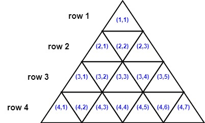
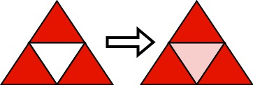

Can you solve this real interview question? Color the Triangle Red - You are given an integer n. Consider an equilateral triangle of side length n, broken up into n2 unit equilateral triangles. The triangle has n 1-indexed rows where the ith row has 2i - 1 unit equilateral triangles.

The triangles in the ith row are also 1-indexed with coordinates from (i, 1) to (i, 2i - 1). The following image shows a triangle of side length 4 with the indexing of its triangle.

Two triangles are neighbors if they share a side. For example:

 * Triangles (1,1) and (2,2) are neighbors
 * Triangles (3,2) and (3,3) are neighbors.
 * Triangles (2,2) and (3,3) are not neighbors because they do not share any side.

Initially, all the unit triangles are white. You want to choose k triangles and color them red. We will then run the following algorithm:

 1. Choose a white triangle that has at least two red neighbors.
    * If there is no such triangle, stop the algorithm.
 2. Color that triangle red.
 3. Go to step 1.

Choose the minimum k possible and set k triangles red before running this algorithm such that after the algorithm stops, all unit triangles are colored red.

Return a 2D list of the coordinates of the triangles that you will color red initially. The answer has to be of the smallest size possible. If there are multiple valid solutions, return any.

 

Example 1:

Input: n = 3
Output: [[1,1],[2,1],[2,3],[3,1],[3,5]]
Explanation: Initially, we choose the shown 5 triangles to be red. Then, we run the algorithm:
- Choose (2,2) that has three red neighbors and color it red.
- Choose (3,2) that has two red neighbors and color it red.
- Choose (3,4) that has three red neighbors and color it red.
- Choose (3,3) that has three red neighbors and color it red.
It can be shown that choosing any 4 triangles and running the algorithm will not make all triangles red.

Example 2:

Input: n = 2
Output: [[1,1],[2,1],[2,3]]
Explanation: Initially, we choose the shown 3 triangles to be red. Then, we run the algorithm:
- Choose (2,2) that has three red neighbors and color it red.
It can be shown that choosing any 2 triangles and running the algorithm will not make all triangles red.

 

Constraints:

 * 1 <= n <= 1000

---

## Images

- Image 1: `image_1.png`
- Image 2: `image_2.png`
- Image 3: `image_3.png`
