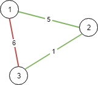

Can you solve this real interview question? Connecting Cities With Minimum Cost - There are n cities labeled from 1 to n. You are given the integer n and an array connections where connections[i] = [xi, yi, costi] indicates that the cost of connecting city xi and city yi (bidirectional connection) is costi.

Return the minimum cost to connect all the n cities such that there is at least one path between each pair of cities. If it is impossible to connect all the n cities, return -1,

The cost is the sum of the connections' costs used.

 

Example 1:

Input: n = 3, connections = [[1,2,5],[1,3,6],[2,3,1]]
Output: 6
Explanation: Choosing any 2 edges will connect all cities so we choose the minimum 2.

Example 2:

Input: n = 4, connections = [[1,2,3],[3,4,4]]
Output: -1
Explanation: There is no way to connect all cities even if all edges are used.

 

Constraints:

 * 1 <= n <= 104
 * 1 <= connections.length <= 104
 * connections[i].length == 3
 * 1 <= xi, yi <= n
 * xi != yi
 * 0 <= costi <= 105

---

## Images

- Image 1: `image_1.png`
- Image 2: `image_2.png`
