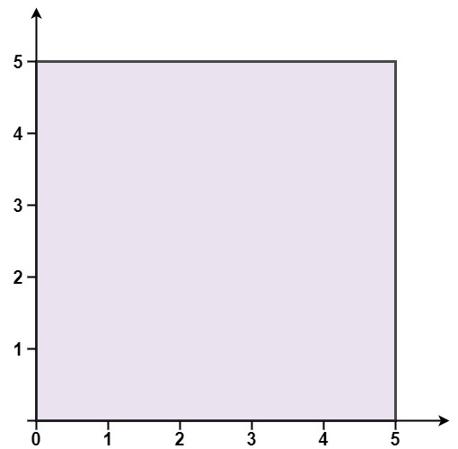

Can you solve this real interview question? Convex Polygon - You are given an array of points on the X-Y plane points where points[i] = [xi, yi]. The points form a polygon when joined sequentially.

Return true if this polygon is convex [http://en.wikipedia.org/wiki/Convex_polygon] and false otherwise.

You may assume the polygon formed by given points is always a simple polygon [http://en.wikipedia.org/wiki/Simple_polygon]. In other words, we ensure that exactly two edges intersect at each vertex and that edges otherwise don't intersect each other.

 

Example 1:

Input: points = [[0,0],[0,5],[5,5],[5,0]]
Output: true

Example 2:

Input: points = [[0,0],[0,10],[10,10],[10,0],[5,5]]
Output: false

 

Constraints:

 * 3 <= points.length <= 104
 * points[i].length == 2
 * -104 <= xi, yi <= 104
 * All the given points are unique.

---

## Images

- Image 1: `image_1.png`
- Image 2: `image_2.png`
