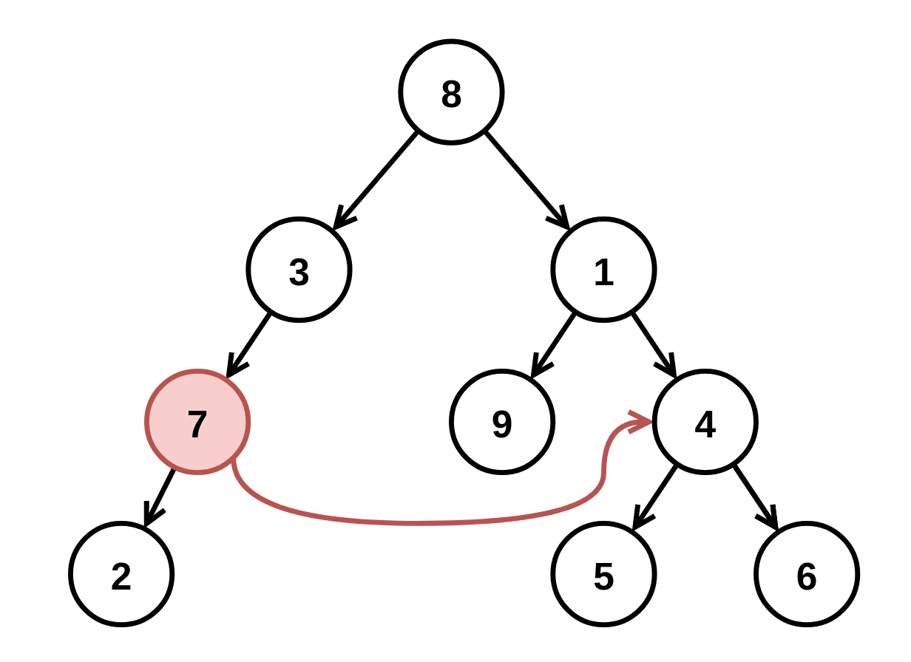

Can you solve this real interview question? Correct a Binary Tree - You have a binary tree with a small defect. There is exactly one invalid node where its right child incorrectly points to another node at the same depth but to the invalid node's right.

Given the root of the binary tree with this defect, root, return the root of the binary tree after removing this invalid node and every node underneath it (minus the node it incorrectly points to).

Custom testing:

The test input is read as 3 lines:

 * TreeNode root
 * int fromNode (not available to correctBinaryTree)
 * int toNode (not available to correctBinaryTree)

After the binary tree rooted at root is parsed, the TreeNode with value of fromNode will have its right child pointer pointing to the TreeNode with a value of toNode. Then, root is passed to correctBinaryTree.

 

Example 1:

Input: root = [1,2,3], fromNode = 2, toNode = 3
Output: [1,null,3]
Explanation: The node with value 2 is invalid, so remove it.

Example 2:

Input: root = [8,3,1,7,null,9,4,2,null,null,null,5,6], fromNode = 7, toNode = 4
Output: [8,3,1,null,null,9,4,null,null,5,6]
Explanation: The node with value 7 is invalid, so remove it and the node underneath it, node 2.

 

Constraints:

 * The number of nodes in the tree is in the range [3, 104].
 * -109 <= Node.val <= 109
 * All Node.val are unique.
 * fromNode != toNode
 * fromNode and toNode will exist in the tree and will be on the same depth.
 * toNode is to the right of fromNode.
 * fromNode.right is null in the initial tree from the test data.

---

## Images

- Image 1: `image_1.png`
- Image 2: `image_2.png`
