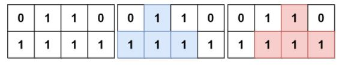
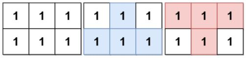
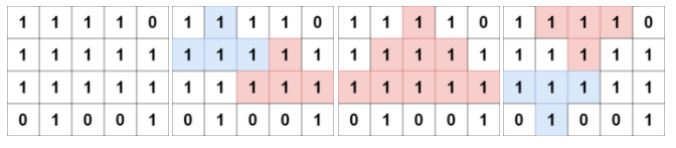

Can you solve this real interview question? Count Fertile Pyramids in a Land - A farmer has a rectangular grid of land with m rows and n columns that can be divided into unit cells. Each cell is either fertile (represented by a 1) or barren (represented by a 0). All cells outside the grid are considered barren.

A pyramidal plot of land can be defined as a set of cells with the following criteria:

 1. The number of cells in the set has to be greater than 1 and all cells must be fertile.
 2. The apex of a pyramid is the topmost cell of the pyramid. The height of a pyramid is the number of rows it covers. Let (r, c) be the apex of the pyramid, and its height be h. Then, the plot comprises of cells (i, j) where r <= i <= r + h - 1 and c - (i - r) <= j <= c + (i - r).

An inverse pyramidal plot of land can be defined as a set of cells with similar criteria:

 1. The number of cells in the set has to be greater than 1 and all cells must be fertile.
 2. The apex of an inverse pyramid is the bottommost cell of the inverse pyramid. The height of an inverse pyramid is the number of rows it covers. Let (r, c) be the apex of the pyramid, and its height be h. Then, the plot comprises of cells (i, j) where r - h + 1 <= i <= r and c - (r - i) <= j <= c + (r - i).

Some examples of valid and invalid pyramidal (and inverse pyramidal) plots are shown below. Black cells indicate fertile cells.

Given a 0-indexed m x n binary matrix grid representing the farmland, return the total number of pyramidal and inverse pyramidal plots that can be found in grid.

 

Example 1:

Input: grid = [[0,1,1,0],[1,1,1,1]]
Output: 2
Explanation: The 2 possible pyramidal plots are shown in blue and red respectively.
There are no inverse pyramidal plots in this grid. 
Hence total number of pyramidal and inverse pyramidal plots is 2 + 0 = 2.

Example 2:

Input: grid = [[1,1,1],[1,1,1]]
Output: 2
Explanation: The pyramidal plot is shown in blue, and the inverse pyramidal plot is shown in red. 
Hence the total number of plots is 1 + 1 = 2.

Example 3:

Input: grid = [[1,1,1,1,0],[1,1,1,1,1],[1,1,1,1,1],[0,1,0,0,1]]
Output: 13
Explanation: There are 7 pyramidal plots, 3 of which are shown in the 2nd and 3rd figures.
There are 6 inverse pyramidal plots, 2 of which are shown in the last figure.
The total number of plots is 7 + 6 = 13.

 

Constraints:

 * m == grid.length
 * n == grid[i].length
 * 1 <= m, n <= 1000
 * 1 <= m * n <= 105
 * grid[i][j] is either 0 or 1.

---

## Images

- Image 1: `image_1.png`
- Image 2: `image_2.png`
- Image 3: `image_3.png`
- Image 4: `image_4.png`
