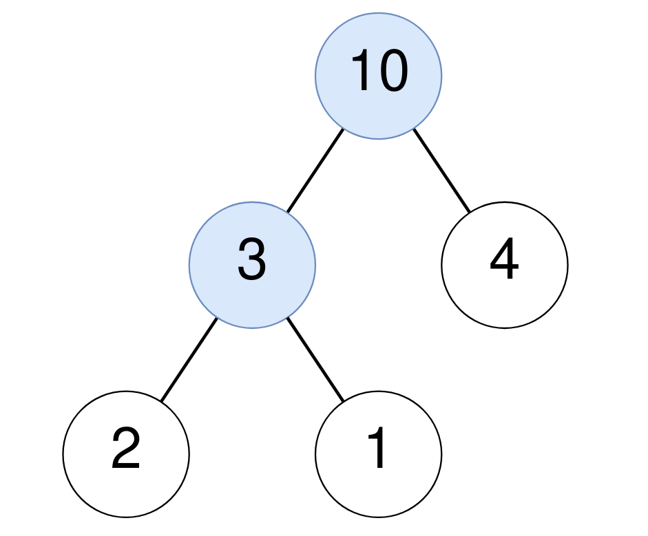

Can you solve this real interview question? Count Nodes Equal to Sum of Descendants - Given the root of a binary tree, return the number of nodes where the value of the node is equal to the sum of the values of its descendants.

A descendant of a node x is any node that is on the path from node x to some leaf node. The sum is considered to be 0 if the node has no descendants.

 

Example 1:

Input: root = [10,3,4,2,1]
Output: 2
Explanation:
For the node with value 10: The sum of its descendants is 3+4+2+1 = 10.
For the node with value 3: The sum of its descendants is 2+1 = 3.

Example 2:

Input: root = [2,3,null,2,null]
Output: 0
Explanation:
No node has a value that is equal to the sum of its descendants.

Example 3:

Input: root = [0]
Output: 1
For the node with value 0: The sum of its descendants is 0 since it has no descendants.

 

Constraints:

 * The number of nodes in the tree is in the range [1, 105].
 * 0 <= Node.val <= 105

---

## Images

- Image 1: `image_1.png`
- Image 2: `image_2.png`
- Image 3: `image_3.png`
