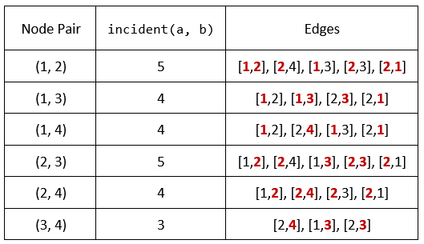

Can you solve this real interview question? Count Pairs Of Nodes - You are given an undirected graph defined by an integer n, the number of nodes, and a 2D integer array edges, the edges in the graph, where edges[i] = [ui, vi] indicates that there is an undirected edge between ui and vi. You are also given an integer array queries.

Let incident(a, b) be defined as the number of edges that are connected to either node a or b.

The answer to the jth query is the number of pairs of nodes (a, b) that satisfy both of the following conditions:

 * a < b
 * incident(a, b) > queries[j]

Return an array answers such that answers.length == queries.length and answers[j] is the answer of the jth query.

Note that there can be multiple edges between the same two nodes.

 

Example 1:

Input: n = 4, edges = [[1,2],[2,4],[1,3],[2,3],[2,1]], queries = [2,3]
Output: [6,5]
Explanation: The calculations for incident(a, b) are shown in the table above.
The answers for each of the queries are as follows:
- answers[0] = 6. All the pairs have an incident(a, b) value greater than 2.
- answers[1] = 5. All the pairs except (3, 4) have an incident(a, b) value greater than 3.

Example 2:

Input: n = 5, edges = [[1,5],[1,5],[3,4],[2,5],[1,3],[5,1],[2,3],[2,5]], queries = [1,2,3,4,5]
Output: [10,10,9,8,6]

 

Constraints:

 * 2 <= n <= 2 * 104
 * 1 <= edges.length <= 105
 * 1 <= ui, vi <= n
 * ui != vi
 * 1 <= queries.length <= 20
 * 0 <= queries[j] < edges.length

---

## Images

- Image 1: `image_1.png`
