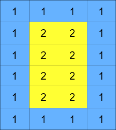
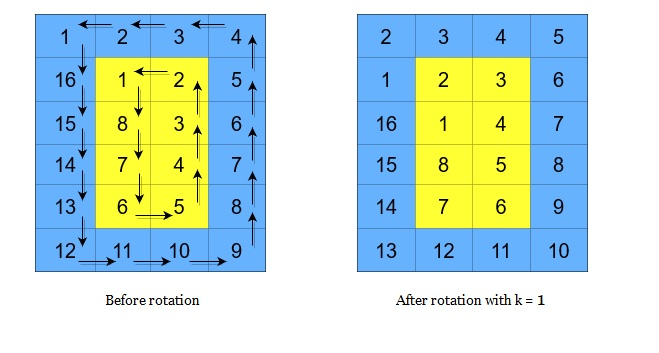

Can you solve this real interview question? Cyclically Rotating a Grid - You are given an m x n integer matrix grid , where m and n are both even integers, and an integer k.

The matrix is composed of several layers, which is shown in the below image, where each color is its own layer:

A cyclic rotation of the matrix is done by cyclically rotating each layer in the matrix. To cyclically rotate a layer once, each element in the layer will take the place of the adjacent element in the counter-clockwise direction. An example rotation is shown below:

Return the matrix after applying k cyclic rotations to it.

 

Example 1:

Input: grid = [[40,10],[30,20]], k = 1
Output: [[10,20],[40,30]]
Explanation: The figures above represent the grid at every state.

Example 2:

  

Input: grid = [[1,2,3,4],[5,6,7,8],[9,10,11,12],[13,14,15,16]], k = 2
Output: [[3,4,8,12],[2,11,10,16],[1,7,6,15],[5,9,13,14]]
Explanation: The figures above represent the grid at every state.

 

Constraints:

 * m == grid.length
 * n == grid[i].length
 * 2 <= m, n <= 50
 * Both m and n are even integers.
 * 1 <= grid[i][j] <= 5000
 * 1 <= k <= 109

---

## Images

- Image 1: `image_1.png`
- Image 2: `image_2.png`
- Image 3: `image_3.png`
- Image 4: `image_4.png`
- Image 5: `image_5.png`
- Image 6: `image_6.png`
