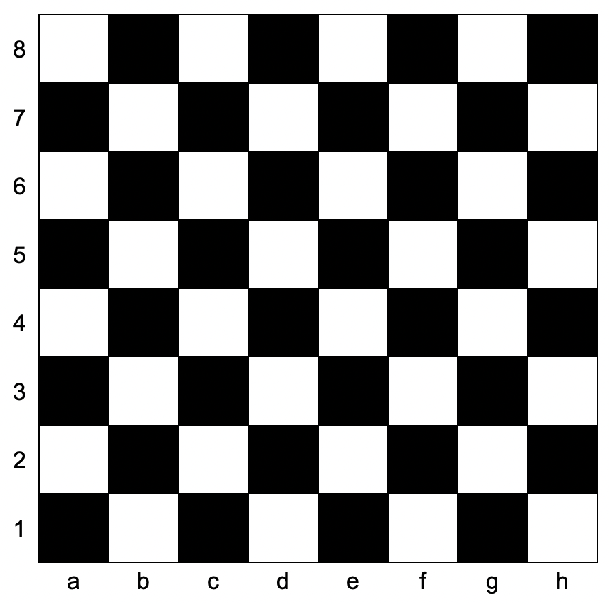

Can you solve this real interview question? Determine Color of a Chessboard Square - You are given coordinates, a string that represents the coordinates of a square of the chessboard. Below is a chessboard for your reference.

Return true if the square is white, and false if the square is black.

The coordinate will always represent a valid chessboard square. The coordinate will always have the letter first, and the number second.

 

Example 1:

Input: coordinates = "a1"
Output: false
Explanation: From the chessboard above, the square with coordinates "a1" is black, so return false.

Example 2:

Input: coordinates = "h3"
Output: true
Explanation: From the chessboard above, the square with coordinates "h3" is white, so return true.

Example 3:

Input: coordinates = "c7"
Output: false

 

Constraints:

 * coordinates.length == 2
 * 'a' <= coordinates[0] <= 'h'
 * '1' <= coordinates[1] <= '8'

---

## Images

- Image 1: `image_1.png`
