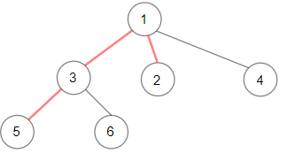
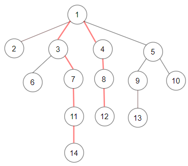

Can you solve this real interview question? Diameter of N-Ary Tree - Given a root of an N-ary tree, you need to compute the length of the diameter of the tree.

The diameter of an N-ary tree is the length of the longest path between any two nodes in the tree. This path may or may not pass through the root.

(Nary-Tree input serialization is represented in their level order traversal, each group of children is separated by the null value.)

 

Example 1:

Input: root = [1,null,3,2,4,null,5,6]
Output: 3
Explanation: Diameter is shown in red color.

Example 2:

Input: root = [1,null,2,null,3,4,null,5,null,6]
Output: 4

Example 3:

Input: root = [1,null,2,3,4,5,null,null,6,7,null,8,null,9,10,null,null,11,null,12,null,13,null,null,14]
Output: 7

 

Constraints:

 * The depth of the n-ary tree is less than or equal to 1000.
 * The total number of nodes is between [1, 104].

---

## Images

- Image 1: `image_1.png`
- Image 2: `image_2.png`
- Image 3: `image_3.png`
