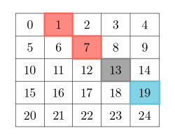

Can you solve this real interview question? Difference of Number of Distinct Values on Diagonals - Given a 2D grid of size m x n, you should find the matrix answer of size m x n.

The cell answer[r][c] is calculated by looking at the diagonal values of the cell grid[r][c]:

 * Let leftAbove[r][c] be the number of distinct values on the diagonal to the left and above the cell grid[r][c] not including the cell grid[r][c] itself.
 * Let rightBelow[r][c] be the number of distinct values on the diagonal to the right and below the cell grid[r][c], not including the cell grid[r][c] itself.
 * Then answer[r][c] = |leftAbove[r][c] - rightBelow[r][c]|.

A matrix diagonal is a diagonal line of cells starting from some cell in either the topmost row or leftmost column and going in the bottom-right direction until the end of the matrix is reached.

 * For example, in the below diagram the diagonal is highlighted using the cell with indices (2, 3) colored gray:
   * Red-colored cells are left and above the cell.
   * Blue-colored cells are right and below the cell.

Return the matrix answer.

 

Example 1:

Input: grid = [[1,2,3],[3,1,5],[3,2,1]]

Output: Output: [[1,1,0],[1,0,1],[0,1,1]]

Explanation:

To calculate the answer cells:

answer left-above elements leftAbove right-below elements rightBelow |leftAbove - rightBelow| [0][0] [] 0 [grid[1][1], grid[2][2]] |{1, 1}| = 1 1 [0][1] [] 0 [grid[1][2]] |{5}| = 1 1 [0][2] [] 0 [] 0 0 [1][0] [] 0 [grid[2][1]] |{2}| = 1 1 [1][1] [grid[0][0]] |{1}| = 1 [grid[2][2]] |{1}| = 1 0 [1][2] [grid[0][1]] |{2}| = 1 [] 0 1 [2][0] [] 0 [] 0 0 [2][1] [grid[1][0]] |{3}| = 1 [] 0 1 [2][2] [grid[0][0], grid[1][1]] |{1, 1}| = 1 [] 0 1

Example 2:

Input: grid = [[1]]

Output: Output: [[0]]

 

Constraints:

 * m == grid.length
 * n == grid[i].length
 * 1 <= m, n, grid[i][j] <= 50

---

## Images

- Image 1: `image_1.png`
