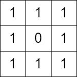

Can you solve this real interview question? Disconnect Path in a Binary Matrix by at Most One Flip - You are given a 0-indexed m x n binary matrix grid. You can move from a cell (row, col) to any of the cells (row + 1, col) or (row, col + 1) that has the value 1. The matrix is disconnected if there is no path from (0, 0) to (m - 1, n - 1).

You can flip the value of at most one (possibly none) cell. You cannot flip the cells (0, 0) and (m - 1, n - 1).

Return true if it is possible to make the matrix disconnect or false otherwise.

Note that flipping a cell changes its value from 0 to 1 or from 1 to 0.

 

Example 1:

Input: grid = [[1,1,1],[1,0,0],[1,1,1]]
Output: true
Explanation: We can change the cell shown in the diagram above. There is no path from (0, 0) to (2, 2) in the resulting grid.

Example 2:

Input: grid = [[1,1,1],[1,0,1],[1,1,1]]
Output: false
Explanation: It is not possible to change at most one cell such that there is not path from (0, 0) to (2, 2).

 

Constraints:

 * m == grid.length
 * n == grid[i].length
 * 1 <= m, n <= 1000
 * 1 <= m * n <= 105
 * grid[i][j] is either 0 or 1.
 * grid[0][0] == grid[m - 1][n - 1] == 1

---

## Images

- Image 1: `image_1.png`
- Image 2: `image_2.png`
