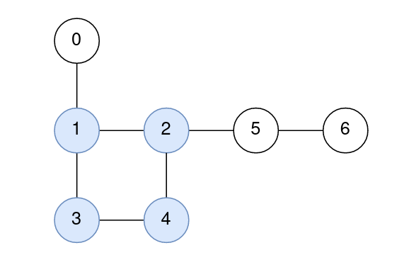
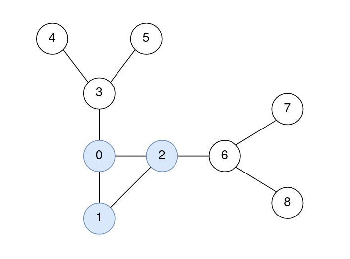

Can you solve this real interview question? Distance to a Cycle in Undirected Graph - You are given a positive integer n representing the number of nodes in a connected undirected graph containing exactly one cycle. The nodes are numbered from 0 to n - 1 (inclusive).

You are also given a 2D integer array edges, where edges[i] = [node1i, node2i] denotes that there is a bidirectional edge connecting node1i and node2i in the graph.

The distance between two nodes a and b is defined to be the minimum number of edges that are needed to go from a to b.

Return an integer array answer of size n, where answer[i] is the minimum distance between the ith node and any node in the cycle.

 

Example 1:

Input: n = 7, edges = [[1,2],[2,4],[4,3],[3,1],[0,1],[5,2],[6,5]]
Output: [1,0,0,0,0,1,2]
Explanation:
The nodes 1, 2, 3, and 4 form the cycle.
The distance from 0 to 1 is 1.
The distance from 1 to 1 is 0.
The distance from 2 to 2 is 0.
The distance from 3 to 3 is 0.
The distance from 4 to 4 is 0.
The distance from 5 to 2 is 1.
The distance from 6 to 2 is 2.

Example 2:

Input: n = 9, edges = [[0,1],[1,2],[0,2],[2,6],[6,7],[6,8],[0,3],[3,4],[3,5]]
Output: [0,0,0,1,2,2,1,2,2]
Explanation:
The nodes 0, 1, and 2 form the cycle.
The distance from 0 to 0 is 0.
The distance from 1 to 1 is 0.
The distance from 2 to 2 is 0.
The distance from 3 to 1 is 1.
The distance from 4 to 1 is 2.
The distance from 5 to 1 is 2.
The distance from 6 to 2 is 1.
The distance from 7 to 2 is 2.
The distance from 8 to 2 is 2.

 

Constraints:

 * 3 <= n <= 105
 * edges.length == n
 * edges[i].length == 2
 * 0 <= node1i, node2i <= n - 1
 * node1i != node2i
 * The graph is connected.
 * The graph has exactly one cycle.
 * There is at most one edge between any pair of vertices.

---

## Images

- Image 1: `image_1.png`
- Image 2: `image_2.png`
