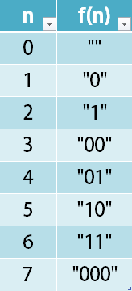

Can you solve this real interview question? Encode Number - Given a non-negative integer num, Return its encoding string.

The encoding is done by converting the integer to a string using a secret function that you should deduce from the following table:

 

Example 1:

Input: num = 23
Output: "1000"

Example 2:

Input: num = 107
Output: "101100"

 

Constraints:

 * 0 <= num <= 10^9

---

## Images

- Image 1: `image_1.png`
