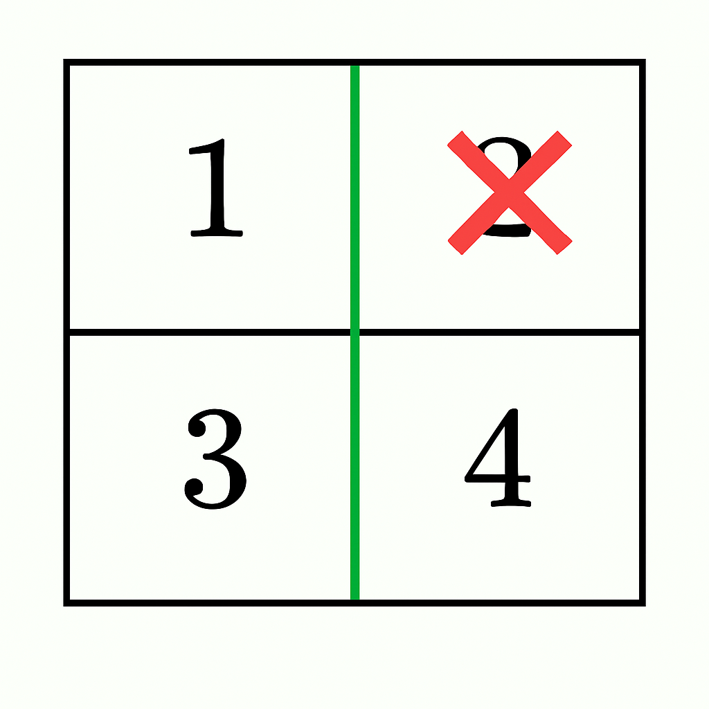

Can you solve this real interview question? Equal Sum Grid Partition II - You are given an m x n matrix grid of positive integers. Your task is to determine if it is possible to make either one horizontal or one vertical cut on the grid such that:

 * Each of the two resulting sections formed by the cut is non-empty.
 * The sum of elements in both sections is equal, or can be made equal by discounting at most one single cell in total (from either section).
 * If a cell is discounted, the rest of the section must remain connected.

Return true if such a partition exists; otherwise, return false.

Note: A section is connected if every cell in it can be reached from any other cell by moving up, down, left, or right through other cells in the section.

 

Example 1:

Input: grid = [[1,4],[2,3]]

Output: true

Explanation:

 * A horizontal cut after the first row gives sums 1 + 4 = 5 and 2 + 3 = 5, which are equal. Thus, the answer is true.

Example 2:

Input: grid = [[1,2],[3,4]]

Output: true

Explanation:

 * A vertical cut after the first column gives sums 1 + 3 = 4 and 2 + 4 = 6.
 * By discounting 2 from the right section (6 - 2 = 4), both sections have equal sums and remain connected. Thus, the answer is true.

Example 3:

Input: grid = [[1,2,4],[2,3,5]]

Output: false

Explanation:

 * A horizontal cut after the first row gives 1 + 2 + 4 = 7 and 2 + 3 + 5 = 10.
 * By discounting 3 from the bottom section (10 - 3 = 7), both sections have equal sums, but they do not remain connected as it splits the bottom section into two parts ([2] and [5]). Thus, the answer is false.

Example 4:

Input: grid = [[4,1,8],[3,2,6]]

Output: false

Explanation:

No valid cut exists, so the answer is false.

 

Constraints:

 * 1 <= m == grid.length <= 105
 * 1 <= n == grid[i].length <= 105
 * 2 <= m * n <= 105
 * 1 <= grid[i][j] <= 105

---

## Images

- Image 1: `image_1.png`
- Image 2: `image_2.png`
- Image 3: `image_3.png`
