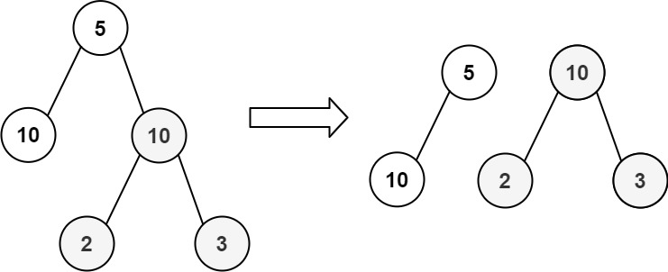

Can you solve this real interview question? Equal Tree Partition - Given the root of a binary tree, return true if you can partition the tree into two trees with equal sums of values after removing exactly one edge on the original tree.

 

Example 1:

Input: root = [5,10,10,null,null,2,3]
Output: true

Example 2:

Input: root = [1,2,10,null,null,2,20]
Output: false
Explanation: You cannot split the tree into two trees with equal sums after removing exactly one edge on the tree.

 

Constraints:

 * The number of nodes in the tree is in the range [1, 104].
 * -105 <= Node.val <= 105

---

## Images

- Image 1: `image_1.png`
- Image 2: `image_2.png`
