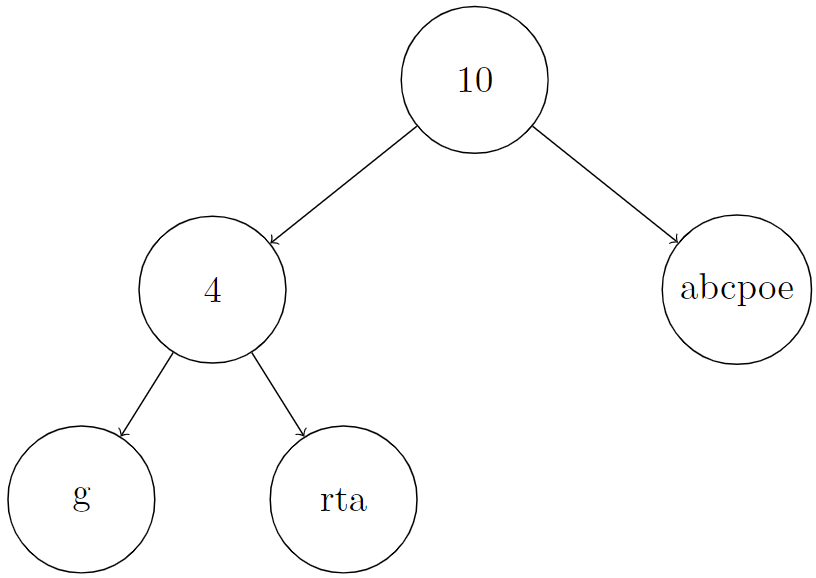

Can you solve this real interview question? Extract Kth Character From The Rope Tree - You are given the root of a binary tree and an integer k. Besides the left and right children, every node of this tree has two other properties, a string node.val containing only lowercase English letters (possibly empty) and a non-negative integer node.len. There are two types of nodes in this tree:

 * Leaf: These nodes have no children, node.len = 0, and node.val is some non-empty string.
 * Internal: These nodes have at least one child (also at most two children), node.len > 0, and node.val is an empty string.

The tree described above is called a Rope binary tree. Now we define S[node] recursively as follows:

 * If node is some leaf node, S[node] = node.val,
 * Otherwise if node is some internal node, S[node] = concat(S[node.left], S[node.right]) and S[node].length = node.len.

Return k-th character of the string S[root].

Note: If s and p are two strings, concat(s, p) is a string obtained by concatenating p to s. For example, concat("ab", "zz") = "abzz".

 

Example 1:

Input: root = [10,4,"abcpoe","g","rta"], k = 6
Output: "b"
Explanation: In the picture below, we put an integer on internal nodes that represents node.len, and a string on leaf nodes that represents node.val.
You can see that S[root] = concat(concat("g", "rta"), "abcpoe") = "grtaabcpoe". So S[root][5], which represents 6th character of it, is equal to "b".

Example 2:

Input: root = [12,6,6,"abc","efg","hij","klm"], k = 3
Output: "c"
Explanation: In the picture below, we put an integer on internal nodes that represents node.len, and a string on leaf nodes that represents node.val.
You can see that S[root] = concat(concat("abc", "efg"), concat("hij", "klm")) = "abcefghijklm". So S[root][2], which represents the 3rd character of it, is equal to "c".

Example 3:

Input: root = ["ropetree"], k = 8
Output: "e"
Explanation: In the picture below, we put an integer on internal nodes that represents node.len, and a string on leaf nodes that represents node.val.
You can see that S[root] = "ropetree". So S[root][7], which represents 8th character of it, is equal to "e".

 

Constraints:

 * The number of nodes in the tree is in the range [1, 103]
 * node.val contains only lowercase English letters
 * 0 <= node.val.length <= 50
 * 0 <= node.len <= 104
 * for leaf nodes, node.len = 0 and node.val is non-empty
 * for internal nodes, node.len > 0 and node.val is empty
 * 1 <= k <= S[root].length

---

## Images

- Image 1: `image_1.png`
- Image 2: `image_2.png`
- Image 3: `image_3.png`
