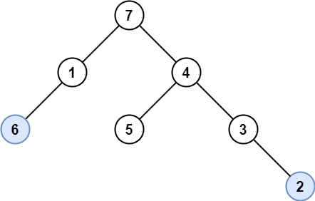

Can you solve this real interview question? Find All The Lonely Nodes - In a binary tree, a lonely node is a node that is the only child of its parent node. The root of the tree is not lonely because it does not have a parent node.

Given the root of a binary tree, return an array containing the values of all lonely nodes in the tree. Return the list in any order.

 

Example 1:

Input: root = [1,2,3,null,4]
Output: [4]
Explanation: Light blue node is the only lonely node.
Node 1 is the root and is not lonely.
Nodes 2 and 3 have the same parent and are not lonely.

Example 2:

Input: root = [7,1,4,6,null,5,3,null,null,null,null,null,2]
Output: [6,2]
Explanation: Light blue nodes are lonely nodes.
Please remember that order doesn't matter, [2,6] is also an acceptable answer.

Example 3:

Input: root = [11,99,88,77,null,null,66,55,null,null,44,33,null,null,22]
Output: [77,55,33,66,44,22]
Explanation: Nodes 99 and 88 share the same parent. Node 11 is the root.
All other nodes are lonely.

 

Constraints:

 * The number of nodes in the tree is in the range [1, 1000].
 * 1 <= Node.val <= 106

---

## Images

- Image 1: `image_1.png`
- Image 2: `image_2.png`
- Image 3: `image_3.png`
