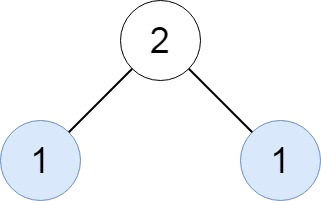
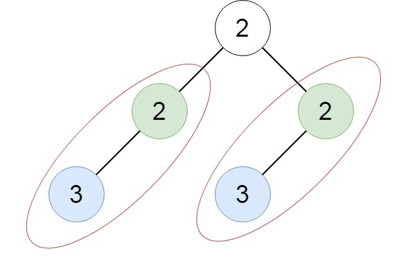

Can you solve this real interview question? Find Duplicate Subtrees - Given the root of a binary tree, return all duplicate subtrees.

For each kind of duplicate subtrees, you only need to return the root node of any one of them.

Two trees are duplicate if they have the same structure with the same node values.

 

Example 1:

Input: root = [1,2,3,4,null,2,4,null,null,4]
Output: [[2,4],[4]]

Example 2:

Input: root = [2,1,1]
Output: [[1]]

Example 3:

Input: root = [2,2,2,3,null,3,null]
Output: [[2,3],[3]]

 

Constraints:

 * The number of the nodes in the tree will be in the range [1, 5000]
 * -200 <= Node.val <= 200

---

## Images

- Image 1: `image_1.png`
- Image 2: `image_2.png`
- Image 3: `image_3.png`
