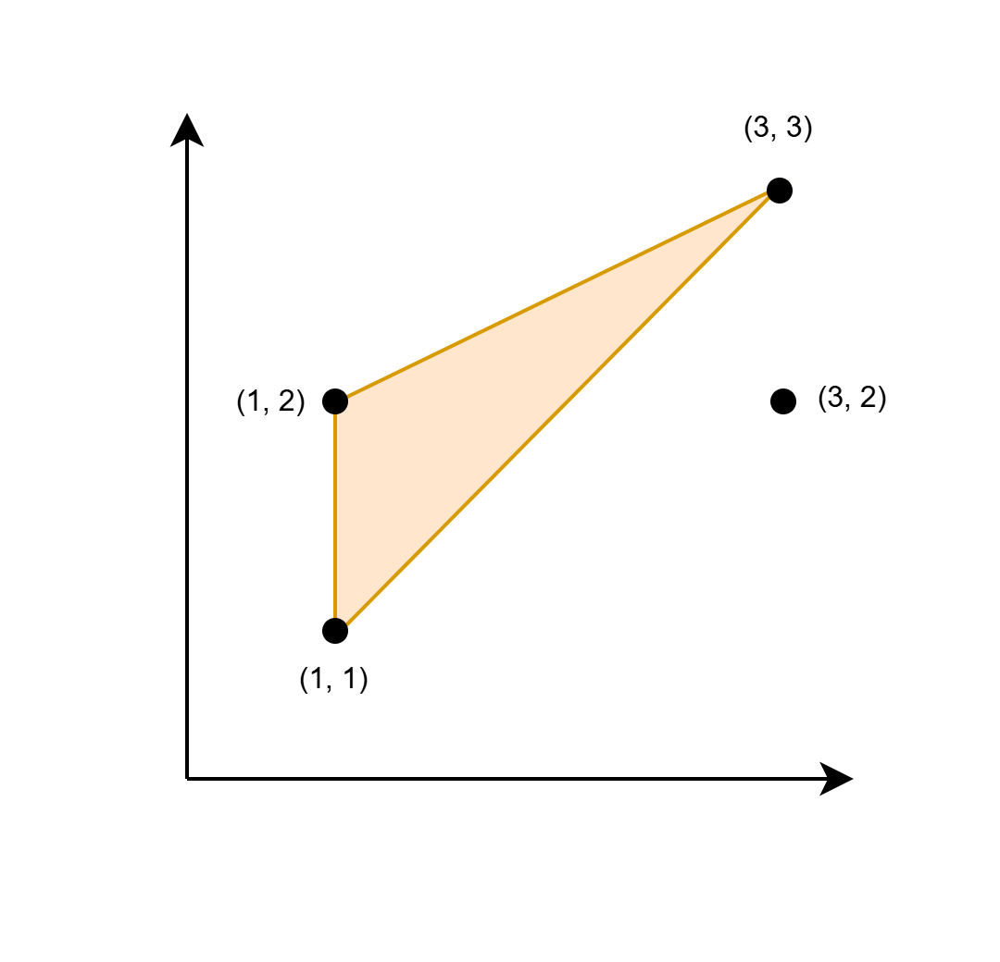

Can you solve this real interview question? Find Maximum Area of a Triangle - You are given a 2D array coords of size n x 2, representing the coordinates of n points in an infinite Cartesian plane.

Find twice the maximum area of a triangle with its corners at any three elements from coords, such that at least one side of this triangle is parallel to the x-axis or y-axis. Formally, if the maximum area of such a triangle is A, return 2 * A.

If no such triangle exists, return -1.

Note that a triangle cannot have zero area.

 

Example 1:

Input: coords = [[1,1],[1,2],[3,2],[3,3]]

Output: 2

Explanation:

The triangle shown in the image has a base 1 and height 2. Hence its area is 1/2 * base * height = 1.

Example 2:

Input: coords = [[1,1],[2,2],[3,3]]

Output: -1

Explanation:

The only possible triangle has corners (1, 1), (2, 2), and (3, 3). None of its sides are parallel to the x-axis or the y-axis.

 

Constraints:

 * 1 <= n == coords.length <= 105
 * 1 <= coords[i][0], coords[i][1] <= 106
 * All coords[i] are unique.

---

## Images

- Image 1: `image_1.png`
