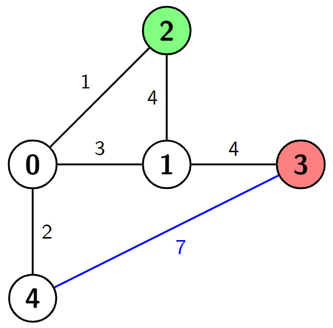

Can you solve this real interview question? Find Shortest Path with K Hops - You are given a positive integer n which is the number of nodes of a 0-indexed undirected weighted connected graph and a 0-indexed 2D array edges where edges[i] = [ui, vi, wi] indicates that there is an edge between nodes ui and vi with weight wi.

You are also given two nodes s and d, and a positive integer k, your task is to find the shortest path from s to d, but you can hop over at most k edges. In other words, make the weight of at most k edges 0 and then find the shortest path from s to d.

Return the length of the shortest path from s to d with the given condition.

 

Example 1:

Input: n = 4, edges = [[0,1,4],[0,2,2],[2,3,6]], s = 1, d = 3, k = 2
Output: 2
Explanation: In this example there is only one path from node 1 (the green node) to node 3 (the red node), which is (1->0->2->3) and the length of it is 4 + 2 + 6 = 12. Now we can make weight of two edges 0, we make weight of the blue edges 0, then we have 0 + 2 + 0 = 2. It can be shown that 2 is the minimum length of a path we can achieve with the given condition.

Example 2:

Input: n = 7, edges = [[3,1,9],[3,2,4],[4,0,9],[0,5,6],[3,6,2],[6,0,4],[1,2,4]], s = 4, d = 1, k = 2
Output: 6
Explanation: In this example there are 2 paths from node 4 (the green node) to node 1 (the red node), which are (4->0->6->3->2->1) and (4->0->6->3->1). The first one has the length 9 + 4 + 2 + 4 + 4 = 23, and the second one has the length 9 + 4 + 2 + 9 = 24. Now if we make weight of the blue edges 0, we get the shortest path with the length 0 + 4 + 2 + 0 = 6. It can be shown that 6 is the minimum length of a path we can achieve with the given condition.

Example 3:

Input: n = 5, edges = [[0,4,2],[0,1,3],[0,2,1],[2,1,4],[1,3,4],[3,4,7]], s = 2, d = 3, k = 1
Output: 3
Explanation: In this example there are 4 paths from node 2 (the green node) to node 3 (the red node), which are (2->1->3), (2->0->1->3), (2->1->0->4->3) and (2->0->4->3). The first two have the length 4 + 4 = 1 + 3 + 4 = 8, the third one has the length 4 + 3 + 2 + 7 = 16 and the last one has the length 1 + 2 + 7 = 10. Now if we make weight of the blue edge 0, we get the shortest path with the length 1 + 2 + 0 = 3. It can be shown that 3 is the minimum length of a path we can achieve with the given condition.

 

Constraints:

 * 2 <= n <= 500
 * n - 1 <= edges.length <= min(104, n * (n - 1) / 2)
 * edges[i].length = 3
 * 0 <= edges[i][0], edges[i][1] <= n - 1
 * 1 <= edges[i][2] <= 106
 * 0 <= s, d, k <= n - 1
 * s != d
 * The input is generated such that the graph is connected and has no repeated edges or self-loops

---

## Images

- Image 1: `image_1.png`
- Image 2: `image_2.png`
- Image 3: `image_3.png`
