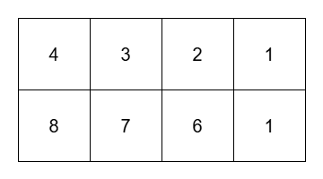

Can you solve this real interview question? Find Sorted Submatrices With Maximum Element at Most K - You are given a 2D matrix grid of size m x n. You are also given a non-negative integer k.

Return the number of submatrices of grid that satisfy the following conditions:

 * The maximum element in the submatrix less than or equal to k.
 * Each row in the submatrix is sorted in non-increasing order.

A submatrix (x1, y1, x2, y2) is a matrix that forms by choosing all cells grid[x][y] where x1 <= x <= x2 and y1 <= y <= y2.

 

Example 1:

Input: grid = [[4,3,2,1],[8,7,6,1]], k = 3

Output: 8

Explanation:

The 8 submatrices are:

 * [[1]]
 * [[1]]
 * [[2,1]]
 * [[3,2,1]]
 * [[1],[1]]
 * [[2]]
 * [[3]]
 * [[3,2]]

Example 2:

Input: grid = [[1,1,1],[1,1,1],[1,1,1]], k = 1

Output: 36

Explanation:

There are 36 submatrices of grid. All submatrices have their maximum element equal to 1.

Example 3:

Input: grid = [[1]], k = 1

Output: 1

 

Constraints:

 * 1 <= m == grid.length <= 103
 * 1 <= n == grid[i].length <= 103
 * 1 <= grid[i][j] <= 109
 * 1 <= k <= 109

 

---

## Images

- Image 1: `image_1.png`
