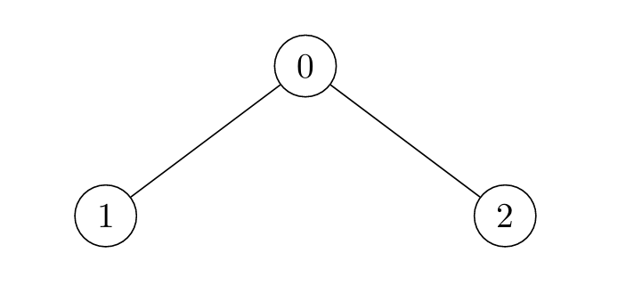

Can you solve this real interview question? Find the Last Marked Nodes in Tree - There exists an undirected tree with n nodes numbered 0 to n - 1. You are given a 2D integer array edges of length n - 1, where edges[i] = [ui, vi] indicates that there is an edge between nodes ui and vi in the tree.

Initially, all nodes are unmarked. After every second, you mark all unmarked nodes which have at least one marked node adjacent to them.

Return an array nodes where nodes[i] is the last node to get marked in the tree, if you mark node i at time t = 0. If nodes[i] has multiple answers for any node i, you can choose any one answer.

 

Example 1:

Input: edges = [[0,1],[0,2]]

Output: [2,2,1]

Explanation:

 * For i = 0, the nodes are marked in the sequence: [0] -> [0,1,2]. Either 1 or 2 can be the answer.
 * For i = 1, the nodes are marked in the sequence: [1] -> [0,1] -> [0,1,2]. Node 2 is marked last.
 * For i = 2, the nodes are marked in the sequence: [2] -> [0,2] -> [0,1,2]. Node 1 is marked last.

Example 2:

Input: edges = [[0,1]]

Output: [1,0]

Explanation:

 * For i = 0, the nodes are marked in the sequence: [0] -> [0,1].
 * For i = 1, the nodes are marked in the sequence: [1] -> [0,1].

Example 3:

Input: edges = [[0,1],[0,2],[2,3],[2,4]]

Output: [3,3,1,1,1]

Explanation:

 * For i = 0, the nodes are marked in the sequence: [0] -> [0,1,2] -> [0,1,2,3,4].
 * For i = 1, the nodes are marked in the sequence: [1] -> [0,1] -> [0,1,2] -> [0,1,2,3,4].
 * For i = 2, the nodes are marked in the sequence: [2] -> [0,2,3,4] -> [0,1,2,3,4].
 * For i = 3, the nodes are marked in the sequence: [3] -> [2,3] -> [0,2,3,4] -> [0,1,2,3,4].
 * For i = 4, the nodes are marked in the sequence: [4] -> [2,4] -> [0,2,3,4] -> [0,1,2,3,4].

 

Constraints:

 * 2 <= n <= 105
 * edges.length == n - 1
 * edges[i].length == 2
 * 0 <= edges[i][0], edges[i][1] <= n - 1
 * The input is generated such that edges represents a valid tree.

---

## Images

- Image 1: `image_1.png`
- Image 2: `image_2.png`
- Image 3: `image_3.png`
