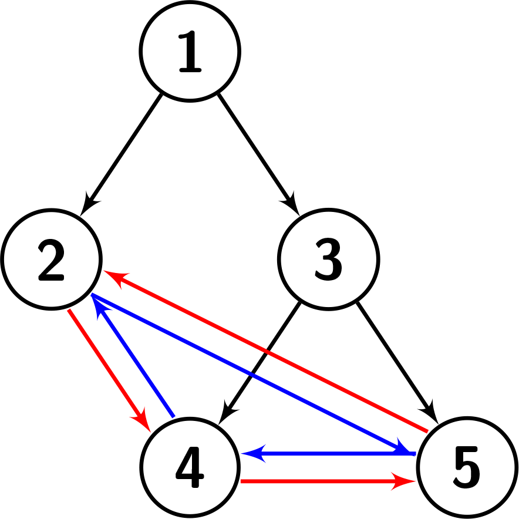

Can you solve this real interview question? Height of Special Binary Tree - You are given a root, which is the root of a special binary tree with n nodes. The nodes of the special binary tree are numbered from 1 to n. Suppose the tree has k leaves in the following order: b1 < b2 < ... < bk.

The leaves of this tree have a special property! That is, for every leaf bi, the following conditions hold:

 * The right child of bi is bi + 1 if i < k, and b1 otherwise.
 * The left child of bi is bi - 1 if i > 1, and bk otherwise.

Return the height of the given tree.

Note: The height of a binary tree is the length of the longest path from the root to any other node.

 

Example 1:

Input: root = [1,2,3,null,null,4,5]
Output: 2
Explanation: The given tree is shown in the following picture. Each leaf's left child is the leaf to its left (shown with the blue edges). Each leaf's right child is the leaf to its right (shown with the red edges). We can see that the graph has a height of 2.

Example 2:

Input: root = [1,2]
Output: 1
Explanation: The given tree is shown in the following picture. There is only one leaf, so it doesn't have any left or right child. We can see that the graph has a height of 1.

Example 3:

Input: root = [1,2,3,null,null,4,null,5,6]
Output: 3
Explanation: The given tree is shown in the following picture. Each leaf's left child is the leaf to its left (shown with the blue edges). Each leaf's right child is the leaf to its right (shown with the red edges). We can see that the graph has a height of 3.

 

Constraints:

 * n == number of nodes in the tree
 * 2 <= n <= 104
 * 1 <= node.val <= n
 * The input is generated such that each node.val is unique.

---

## Images

- Image 1: `image_1.png`
- Image 2: `image_2.png`
- Image 3: `image_3.png`
