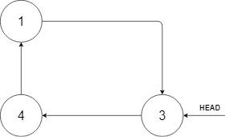

Can you solve this real interview question? Insert into a Sorted Circular Linked List - Given a Circular Linked List node, which is sorted in non-descending order, write a function to insert a value insertVal into the list such that it remains a sorted circular list. The given node can be a reference to any single node in the list and may not necessarily be the smallest value in the circular list.

If there are multiple suitable places for insertion, you may choose any place to insert the new value. After the insertion, the circular list should remain sorted.

If the list is empty (i.e., the given node is null), you should create a new single circular list and return the reference to that single node. Otherwise, you should return the originally given node.

 

Example 1:

 

Input: head = [3,4,1], insertVal = 2
Output: [3,4,1,2]
Explanation: In the figure above, there is a sorted circular list of three elements. You are given a reference to the node with value 3, and we need to insert 2 into the list. The new node should be inserted between node 1 and node 3. After the insertion, the list should look like this, and we should still return node 3.

Example 2:

Input: head = [], insertVal = 1
Output: [1]
Explanation: The list is empty (given head is null). We create a new single circular list and return the reference to that single node.

Example 3:

Input: head = [1], insertVal = 0
Output: [1,0]

 

Constraints:

 * The number of nodes in the list is in the range [0, 5 * 104].
 * -106 <= Node.val, insertVal <= 106

---

## Images

- Image 1: `image_1.png`
- Image 2: `image_2.png`
