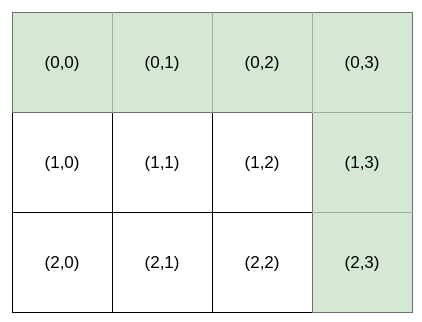
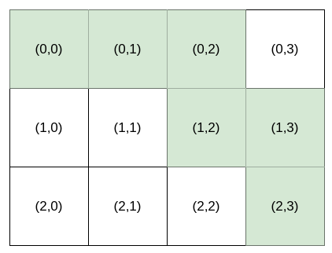

Can you solve this real interview question? Kth Smallest Instructions - Bob is standing at cell (0, 0), and he wants to reach destination: (row, column). He can only travel right and down. You are going to help Bob by providing instructions for him to reach destination.

The instructions are represented as a string, where each character is either:

 * 'H', meaning move horizontally (go right), or
 * 'V', meaning move vertically (go down).

Multiple instructions will lead Bob to destination. For example, if destination is (2, 3), both "HHHVV" and "HVHVH" are valid instructions.

However, Bob is very picky. Bob has a lucky number k, and he wants the kth lexicographically smallest instructions that will lead him to destination. k is 1-indexed.

Given an integer array destination and an integer k, return the kth lexicographically smallest instructions that will take Bob to destination.

 

Example 1:

Input: destination = [2,3], k = 1
Output: "HHHVV"
Explanation: All the instructions that reach (2, 3) in lexicographic order are as follows:
["HHHVV", "HHVHV", "HHVVH", "HVHHV", "HVHVH", "HVVHH", "VHHHV", "VHHVH", "VHVHH", "VVHHH"].

Example 2:

Input: destination = [2,3], k = 2
Output: "HHVHV"

Example 3:

Input: destination = [2,3], k = 3
Output: "HHVVH"

 

Constraints:

 * destination.length == 2
 * 1 <= row, column <= 15
 * 1 <= k <= nCr(row + column, row), where nCr(a, b) denotes a choose b .

---

## Images

- Image 1: `image_1.png`
- Image 2: `image_2.png`
- Image 3: `image_3.png`
