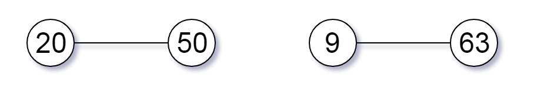
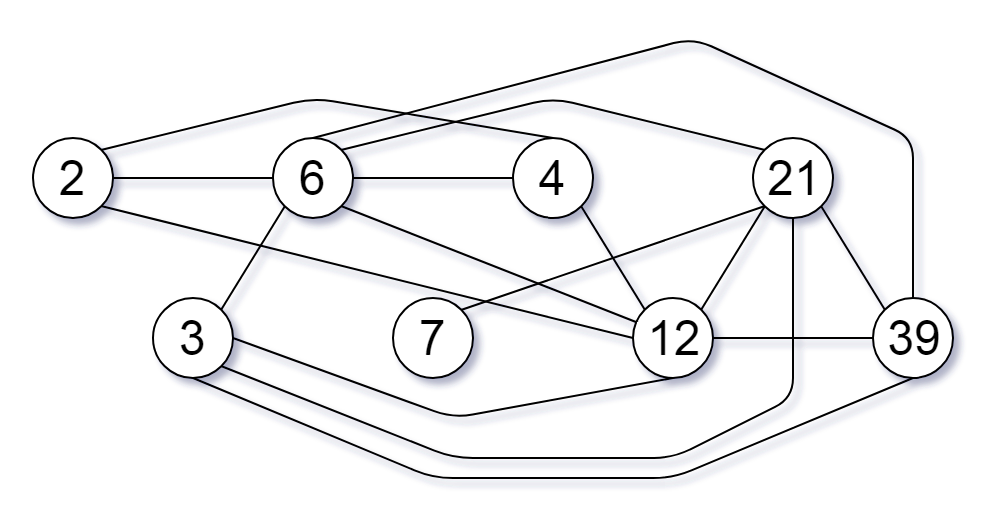

Can you solve this real interview question? Largest Component Size by Common Factor - You are given an integer array of unique positive integers nums. Consider the following graph:

 * There are nums.length nodes, labeled nums[0] to nums[nums.length - 1],
 * There is an undirected edge between nums[i] and nums[j] if nums[i] and nums[j] share a common factor greater than 1.

Return the size of the largest connected component in the graph.

 

Example 1:

Input: nums = [4,6,15,35]
Output: 4

Example 2:

Input: nums = [20,50,9,63]
Output: 2

Example 3:

Input: nums = [2,3,6,7,4,12,21,39]
Output: 8

 

Constraints:

 * 1 <= nums.length <= 2 * 104
 * 1 <= nums[i] <= 105
 * All the values of nums are unique.

---

## Images

- Image 1: `image_1.png`
- Image 2: `image_2.png`
- Image 3: `image_3.png`
