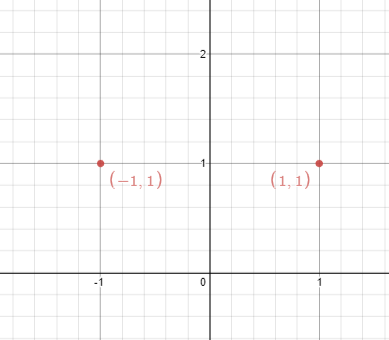

Can you solve this real interview question? Line Reflection - Given n points on a 2D plane, find if there is such a line parallel to the y-axis that reflects the given points symmetrically.

In other words, answer whether or not if there exists a line that after reflecting all points over the given line, the original points' set is the same as the reflected ones.

Note that there can be repeated points.

 

Example 1:

Input: points = [[1,1],[-1,1]]
Output: true
Explanation: We can choose the line x = 0.

Example 2:

Input: points = [[1,1],[-1,-1]]
Output: false
Explanation: We can't choose a line.

 

Constraints:

 * n == points.length
 * 1 <= n <= 104
 * -108 <= points[i][j] <= 108

 

Follow up: Could you do better than O(n2)?

---

## Images

- Image 1: `image_1.png`
- Image 2: `image_2.png`
