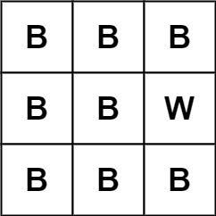

Can you solve this real interview question? Lonely Pixel I - Given an m x n picture consisting of black 'B' and white 'W' pixels, return the number of black lonely pixels.

A black lonely pixel is a character 'B' that located at a specific position where the same row and same column don't have any other black pixels.

 

Example 1:

Input: picture = [["W","W","B"],["W","B","W"],["B","W","W"]]
Output: 3
Explanation: All the three 'B's are black lonely pixels.

Example 2:

Input: picture = [["B","B","B"],["B","B","W"],["B","B","B"]]
Output: 0

 

Constraints:

 * m == picture.length
 * n == picture[i].length
 * 1 <= m, n <= 500
 * picture[i][j] is 'W' or 'B'.

---

## Images

- Image 1: `image_1.png`
- Image 2: `image_2.png`
