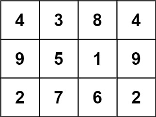
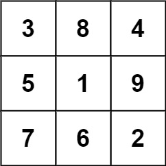

Can you solve this real interview question? Magic Squares In Grid - A 3 x 3 magic square is a 3 x 3 grid filled with distinct numbers from 1 to 9 such that each row, column, and both diagonals all have the same sum.

Given a row x col grid of integers, how many 3 x 3 magic square subgrids are there?

Note: while a magic square can only contain numbers from 1 to 9, grid may contain numbers up to 15.

 

Example 1:

Input: grid = [[4,3,8,4],[9,5,1,9],[2,7,6,2]]
Output: 1
Explanation: 
The following subgrid is a 3 x 3 magic square:

while this one is not:

In total, there is only one magic square inside the given grid.

Example 2:

Input: grid = [[8]]
Output: 0

 

Constraints:

 * row == grid.length
 * col == grid[i].length
 * 1 <= row, col <= 10
 * 0 <= grid[i][j] <= 15

---

## Images

- Image 1: `image_1.png`
- Image 2: `image_2.png`
- Image 3: `image_3.png`
