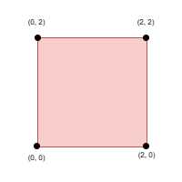

Can you solve this real interview question? Maximize the Distance Between Points on a Square - You are given an integer side, representing the edge length of a square with corners at (0, 0), (0, side), (side, 0), and (side, side) on a Cartesian plane.

You are also given a positive integer k and a 2D integer array points, where points[i] = [xi, yi] represents the coordinate of a point lying on the boundary of the square.

You need to select k elements among points such that the minimum Manhattan distance between any two points is maximized.

Return the maximum possible minimum Manhattan distance between the selected k points.

The Manhattan Distance between two cells (xi, yi) and (xj, yj) is |xi - xj| + |yi - yj|.

 

Example 1:

Input: side = 2, points = [[0,2],[2,0],[2,2],[0,0]], k = 4

Output: 2

Explanation:

Select all four points.

Example 2:

Input: side = 2, points = [[0,0],[1,2],[2,0],[2,2],[2,1]], k = 4

Output: 1

Explanation:

Select the points (0, 0), (2, 0), (2, 2), and (2, 1).

Example 3:

Input: side = 2, points = [[0,0],[0,1],[0,2],[1,2],[2,0],[2,2],[2,1]], k = 5

Output: 1

Explanation:

Select the points (0, 0), (0, 1), (0, 2), (1, 2), and (2, 2).

 

Constraints:

 * 1 <= side <= 109
 * 4 <= points.length <= min(4 * side, 15 * 103)
 * points[i] == [xi, yi]
 * The input is generated such that:
   * points[i] lies on the boundary of the square.
   * All points[i] are unique.
 * 4 <= k <= min(25, points.length)

---

## Images

- Image 1: `image_1.png`
- Image 2: `image_2.png`
- Image 3: `image_3.png`
