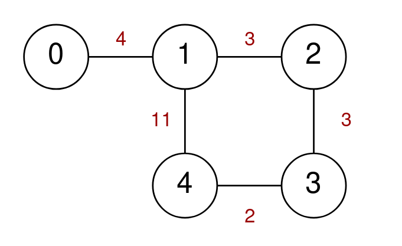
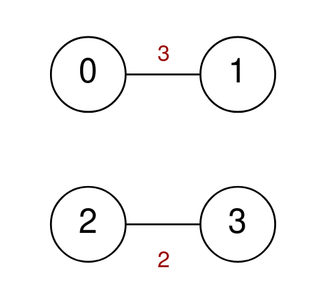

Can you solve this real interview question? Maximum Cost of Trip With K Highways - A series of highways connect n cities numbered from 0 to n - 1. You are given a 2D integer array highways where highways[i] = [city1i, city2i, tolli] indicates that there is a highway that connects city1i and city2i, allowing a car to go from city1i to city2i and vice versa for a cost of tolli.

You are also given an integer k. You are going on a trip that crosses exactly k highways. You may start at any city, but you may only visit each city at most once during your trip.

Return the maximum cost of your trip. If there is no trip that meets the requirements, return -1.

 

Example 1:

Input: n = 5, highways = [[0,1,4],[2,1,3],[1,4,11],[3,2,3],[3,4,2]], k = 3
Output: 17
Explanation:
One possible trip is to go from 0 -> 1 -> 4 -> 3. The cost of this trip is 4 + 11 + 2 = 17.
Another possible trip is to go from 4 -> 1 -> 2 -> 3. The cost of this trip is 11 + 3 + 3 = 17.
It can be proven that 17 is the maximum possible cost of any valid trip.

Note that the trip 4 -> 1 -> 0 -> 1 is not allowed because you visit the city 1 twice.

Example 2:

Input: n = 4, highways = [[0,1,3],[2,3,2]], k = 2
Output: -1
Explanation: There are no valid trips of length 2, so return -1.

 

Constraints:

 * 2 <= n <= 15
 * 1 <= highways.length <= 50
 * highways[i].length == 3
 * 0 <= city1i, city2i <= n - 1
 * city1i != city2i
 * 0 <= tolli <= 100
 * 1 <= k <= 50
 * There are no duplicate highways.

---

## Images

- Image 1: `image_1.png`
- Image 2: `image_2.png`
