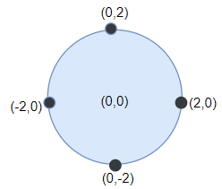

Can you solve this real interview question? Maximum Number of Darts Inside of a Circular Dartboard - Alice is throwing n darts on a very large wall. You are given an array darts where darts[i] = [xi, yi] is the position of the ith dart that Alice threw on the wall.

Bob knows the positions of the n darts on the wall. He wants to place a dartboard of radius r on the wall so that the maximum number of darts that Alice throws lie on the dartboard.

Given the integer r, return the maximum number of darts that can lie on the dartboard.

 

Example 1:

Input: darts = [[-2,0],[2,0],[0,2],[0,-2]], r = 2
Output: 4
Explanation: Circle dartboard with center in (0,0) and radius = 2 contain all points.

Example 2:

Input: darts = [[-3,0],[3,0],[2,6],[5,4],[0,9],[7,8]], r = 5
Output: 5
Explanation: Circle dartboard with center in (0,4) and radius = 5 contain all points except the point (7,8).

 

Constraints:

 * 1 <= darts.length <= 100
 * darts[i].length == 2
 * -104 <= xi, yi <= 104
 * All the darts are unique
 * 1 <= r <= 5000

---

## Images

- Image 1: `image_1.png`
- Image 2: `image_2.png`
