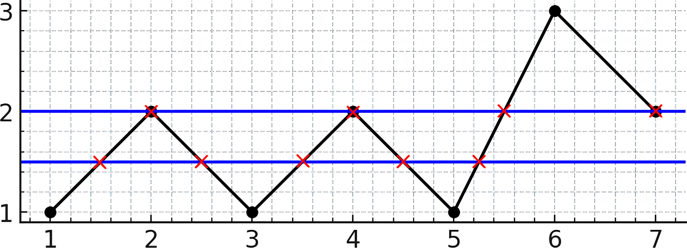
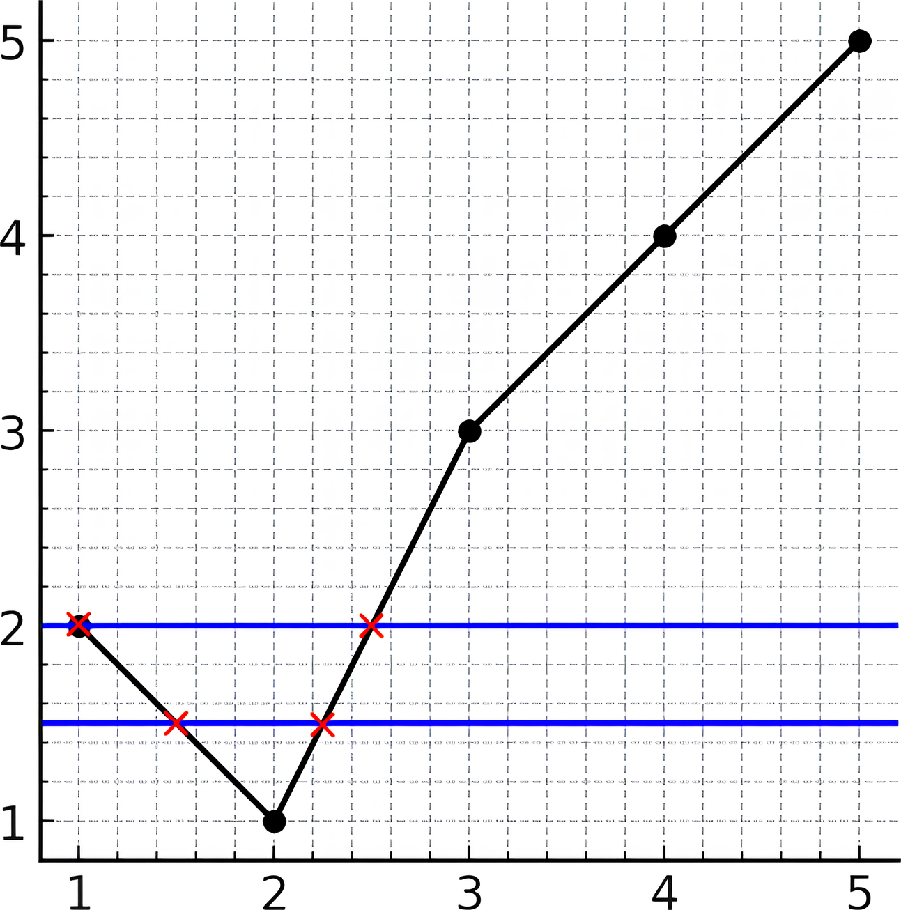

Can you solve this real interview question? Maximum Number of Intersections on the Chart - There is a line chart consisting of n points connected by line segments. You are given a 1-indexed integer array y. The kth point has coordinates (k, y[k]). There are no horizontal lines; that is, no two consecutive points have the same y-coordinate.

We can draw an infinitely long horizontal line. Return the maximum number of points of intersection of the line with the chart.

 

Example 1:

Input: y = [1,2,1,2,1,3,2]
Output: 5
Explanation: As you can see in the image above, the line y = 1.5 has 5 intersections with the chart (in red crosses). You can also see the line y = 2 which intersects the chart in 4 points (in red crosses). It can be shown that there is no horizontal line intersecting the chart at more than 5 points. So the answer would be 5.

Example 2:

Input: y = [2,1,3,4,5]
Output: 2
Explanation: As you can see in the image above, the line y = 1.5 has 2 intersections with the chart (in red crosses). You can also see the line y = 2 which intersects the chart in 2 points (in red crosses). It can be shown that there is no horizontal line intersecting the chart at more than 2 points. So the answer would be 2.

 

Constraints:

 * 2 <= y.length <= 105
 * 1 <= y[i] <= 109
 * y[i] != y[i + 1] for i in range [1, n - 1]

---

## Images

- Image 1: `image_1.png`
- Image 2: `image_2.png`
