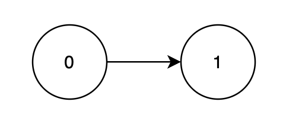

Can you solve this real interview question? Maximum Profit from Valid Topological Order in DAG - You are given a Directed Acyclic Graph (DAG) with n nodes labeled from 0 to n - 1, represented by a 2D array edges, where edges[i] = [ui, vi] indicates a directed edge from node ui to vi. Each node has an associated score given in an array score, where score[i] represents the score of node i.

You must process the nodes in a valid topological order. Each node is assigned a 1-based position in the processing order.

The profit is calculated by summing up the product of each node's score and its position in the ordering.

Return the maximum possible profit achievable with an optimal topological order.

A topological order of a DAG is a linear ordering of its nodes such that for every directed edge u → v, node u comes before v in the ordering.

 

Example 1:

Input: n = 2, edges = [[0,1]], score = [2,3]

Output: 8

Explanation:

Node 1 depends on node 0, so a valid order is [0, 1].

Node Processing Order Score Multiplier Profit Calculation 0 1st 2 1 2 × 1 = 2 1 2nd 3 2 3 × 2 = 6

The maximum total profit achievable over all valid topological orders is 2 + 6 = 8.

Example 2:

Input: n = 3, edges = [[0,1],[0,2]], score = [1,6,3]

Output: 25

Explanation:

Nodes 1 and 2 depend on node 0, so the most optimal valid order is [0, 2, 1].

Node Processing Order Score Multiplier Profit Calculation 0 1st 1 1 1 × 1 = 1 2 2nd 3 2 3 × 2 = 6 1 3rd 6 3 6 × 3 = 18

The maximum total profit achievable over all valid topological orders is 1 + 6 + 18 = 25.

 

Constraints:

 * 1 <= n == score.length <= 22
 * 1 <= score[i] <= 105
 * 0 <= edges.length <= n * (n - 1) / 2
 * edges[i] == [ui, vi] denotes a directed edge from ui to vi.
 * 0 <= ui, vi < n
 * ui != vi
 * The input graph is guaranteed to be a DAG.
 * There are no duplicate edges.

---

## Images

- Image 1: `image_1.png`
- Image 2: `image_2.png`
