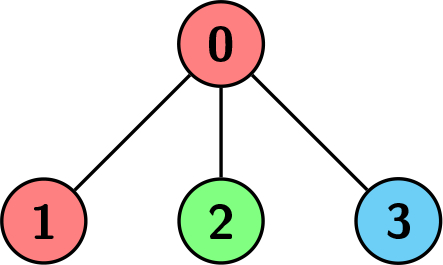

Can you solve this real interview question? Maximum Subtree of the Same Color - You are given a 2D integer array edges representing a tree with n nodes, numbered from 0 to n - 1, rooted at node 0, where edges[i] = [ui, vi] means there is an edge between the nodes vi and ui.

You are also given a 0-indexed integer array colors of size n, where colors[i] is the color assigned to node i.

We want to find a node v such that every node in the subtree of v has the same color.

Return the size of such subtree with the maximum number of nodes possible.

 

Example 1:

Input: edges = [[0,1],[0,2],[0,3]], colors = [1,1,2,3]
Output: 1
Explanation: Each color is represented as: 1 -> Red, 2 -> Green, 3 -> Blue. We can see that the subtree rooted at node 0 has children with different colors. Any other subtree is of the same color and has a size of 1. Hence, we return 1.

Example 2:

Input: edges = [[0,1],[0,2],[0,3]], colors = [1,1,1,1]
Output: 4
Explanation: The whole tree has the same color, and the subtree rooted at node 0 has the most number of nodes which is 4. Hence, we return 4.

Example 3:

Input: edges = [[0,1],[0,2],[2,3],[2,4]], colors = [1,2,3,3,3]
Output: 3
Explanation: Each color is represented as: 1 -> Red, 2 -> Green, 3 -> Blue. We can see that the subtree rooted at node 0 has children with different colors. Any other subtree is of the same color, but the subtree rooted at node 2 has a size of 3 which is the maximum. Hence, we return 3.

 

Constraints:

 * n == edges.length + 1
 * 1 <= n <= 5 * 104
 * edges[i] == [ui, vi]
 * 0 <= ui, vi < n
 * colors.length == n
 * 1 <= colors[i] <= 105
 * The input is generated such that the graph represented by edges is a tree.

---

## Images

- Image 1: `image_1.png`
- Image 2: `image_2.png`
