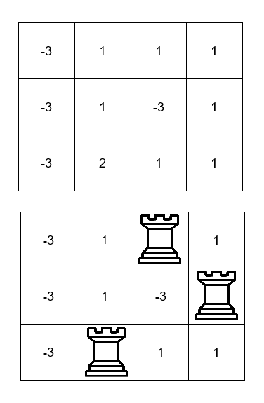

Can you solve this real interview question? Maximum Value Sum by Placing Three Rooks I - You are given a m x n 2D array board representing a chessboard, where board[i][j] represents the value of the cell (i, j).

Rooks in the same row or column attack each other. You need to place three rooks on the chessboard such that the rooks do not attack each other.

Return the maximum sum of the cell values on which the rooks are placed.

 

Example 1:

Input: board = [[-3,1,1,1],[-3,1,-3,1],[-3,2,1,1]]

Output: 4

Explanation:

We can place the rooks in the cells (0, 2), (1, 3), and (2, 1) for a sum of 1 + 1 + 2 = 4.

Example 2:

Input: board = [[1,2,3],[4,5,6],[7,8,9]]

Output: 15

Explanation:

We can place the rooks in the cells (0, 0), (1, 1), and (2, 2) for a sum of 1 + 5 + 9 = 15.

Example 3:

Input: board = [[1,1,1],[1,1,1],[1,1,1]]

Output: 3

Explanation:

We can place the rooks in the cells (0, 2), (1, 1), and (2, 0) for a sum of 1 + 1 + 1 = 3.

 

Constraints:

 * 3 <= m == board.length <= 100
 * 3 <= n == board[i].length <= 100
 * -109 <= board[i][j] <= 109

---

## Images

- Image 1: `image_1.png`
