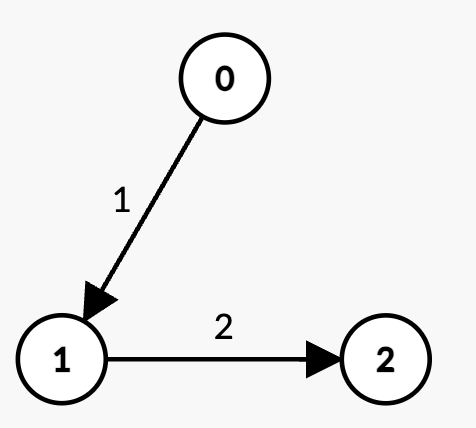
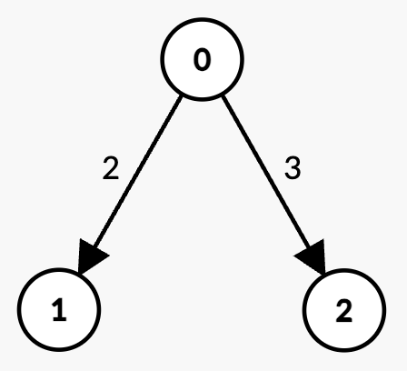

Can you solve this real interview question? Maximum Weighted K-Edge Path - You are given an integer n and a Directed Acyclic Graph (DAG) with n nodes labeled from 0 to n - 1. This is represented by a 2D array edges, where edges[i] = [ui, vi, wi] indicates a directed edge from node ui to vi with weight wi.

You are also given two integers, k and t.

Your task is to determine the maximum possible sum of edge weights for any path in the graph such that:

 * The path contains exactly k edges.
 * The total sum of edge weights in the path is strictly less than t.

Return the maximum possible sum of weights for such a path. If no such path exists, return -1.

 

Example 1:

Input: n = 3, edges = [[0,1,1],[1,2,2]], k = 2, t = 4

Output: 3

Explanation:

 * The only path with k = 2 edges is 0 -> 1 -> 2 with weight 1 + 2 = 3 < t.
 * Thus, the maximum possible sum of weights less than t is 3.

Example 2:

Input: n = 3, edges = [[0,1,2],[0,2,3]], k = 1, t = 3

Output: 2

Explanation:

 * There are two paths with k = 1 edge:
   * 0 -> 1 with weight 2 < t.
   * 0 -> 2 with weight 3 = t, which is not strictly less than t.
 * Thus, the maximum possible sum of weights less than t is 2.

Example 3:

Input: n = 3, edges = [[0,1,6],[1,2,8]], k = 1, t = 6

Output: -1

Explanation:

 * There are two paths with k = 1 edge:
   * 0 -> 1 with weight 6 = t, which is not strictly less than t.
   * 1 -> 2 with weight 8 > t, which is not strictly less than t.
 * Since there is no path with sum of weights strictly less than t, the answer is -1.

 

Constraints:

 * 1 <= n <= 300
 * 0 <= edges.length <= 300
 * edges[i] = [ui, vi, wi]
 * 0 <= ui, vi < n
 * ui != vi
 * 1 <= wi <= 10
 * 0 <= k <= 300
 * 1 <= t <= 600
 * The input graph is guaranteed to be a DAG.
 * There are no duplicate edges.

---

## Images

- Image 1: `image_1.png`
- Image 2: `image_2.png`
- Image 3: `image_3.png`
